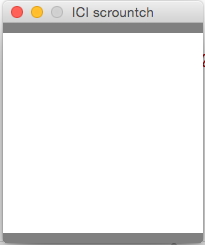
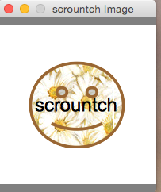
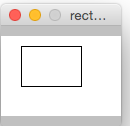
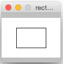
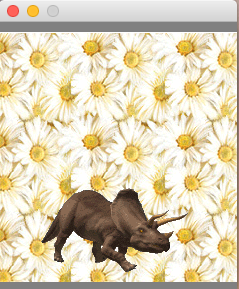
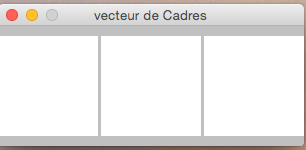
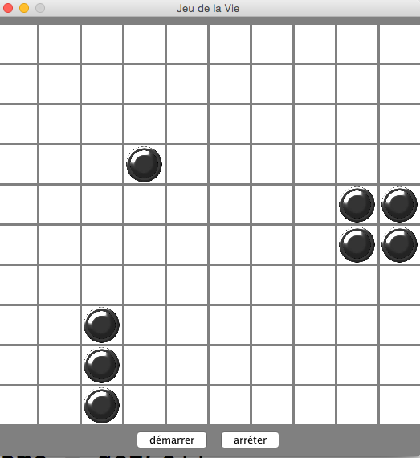
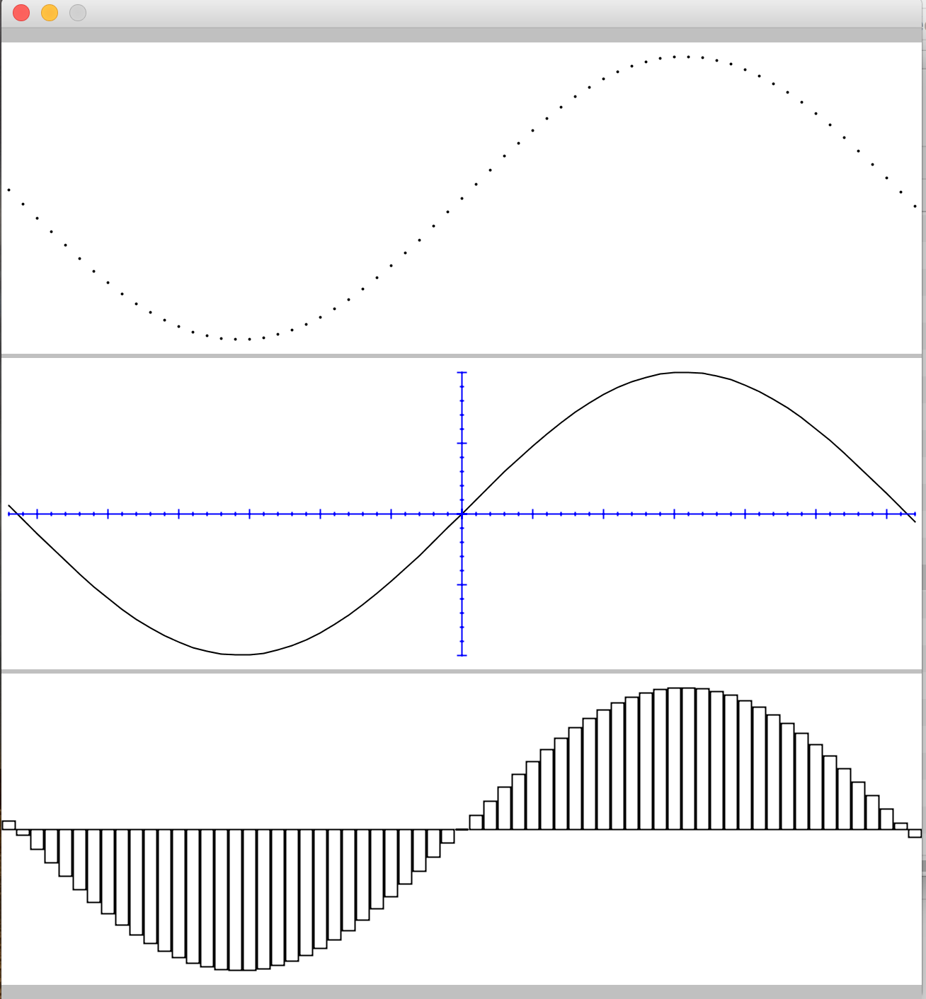

= Scrountch
:Author: Bernard AMADE
:doctype: book
:version: v1.2 Fevrier. 2017
:lang: fr
:footer: (C) PB.Amade

////////////////////
 voir les TODO
////////////////////

== Scrountch: une librairie graphique pour débutants

+scrountch+ est une bibliothèque de codes graphiques liée au langage +Groovy+ .

Ces codes donnent un accès simplifié à des fonctionnalités d'ordre graphique destinées à l'apprentissage
de la programmation. Le langage recommandé pour utiliser cette bibliothèque est un sous-ensemble de Groovy.

La description de cette version simplifiée du langage +Groovy+  se trouve dans le livre: "introduction à la programmation informatique: principes et enjeux".

Même s'il s'agit d'un outil dont l'objectif est d'abord de sensibiliser à la programmation
on notera que la pratique approfondie de +scrountch+ demande de la concentration et donc se situe un peu au-dessus des utilitaires
purement réservés aux novices (genre +Scratch+). 
On peut donc, dans un premier temps, réaliser des exercices simples (tels qu'ils sont décrits dans l'ouvrage de référence): ce niveau
de +scrountch+ convient à tous les débutants. Ceux qui commencent à se sentir à l'aise peuvent ensuite passer à des niveaux
plus complexes dont les détails sont donnés dans cette notice. On a donc ici un outil avec deux niveaux possibles de prise en main.

//Un résumé se trouve en fin de ce document dans le chapitre "éléments de programmation".

Une caractéristique remarquable de +scrountch+ est que ses codes  sont automatiquement traduits dans la langue de l'utilisateur.
Les codes d'origines ont des noms Anglais mais un dictionnaire permet leur traduction: le programmeur débutant
n'a donc que très peu de mots anglais à retenir pour programmer et peut se concentrer sur la logique de son code.

Les quelques mots anglais restants concernent la structuration des codes (+if+, +while+, ..) et les types fondamentaux
(+int+, +double+, +String+ ,...) - C'est donc peu de choses à retenir -

Dans certains cas (messages d'erreur) il se peut que les noms sous-jacents  des codes apparaissent. Pour cette raison
ce petit manuel donne à chaque fois les deux noms du code: le nom en Fançais traduit et le nom "réel" .

La présentation de cette librairie est progressive: les mêmes fonctionnalités sont présentées plusieurs fois avec des difficultés progressives.
A la fin un programmeur expérimenté pourra se mettre à la programmation orientée objet et enrichir les codes
en se servant des codes graphiques des bibliothèques +java.awt+ (qui servent de base aux codes de +scrountch+)

=== Installation

Au lieu d'utiliser la +groovyconsole+ on utilisera un code dérivé nommé +scrountchconsole+.

Pour déployer cet outil vous devez disposer d'un fichier nommé +scrountchConsole.jar+: double-cliquez dessus et vous disposez d'une console pour saisir vos codes
et les exécuter.

image:scr_images/scrountchConsole.png[console]

Ensuite pour des pratiques plus avancés il conviendra d'installer +Groovy+ , de positionner la variable d'environnement +GROOVY_HOME+ ,
et d'utiliser en ressources de fichier +scrountch.jar+
(ce fichier jar n'est pas exécutable et ne contient pas groovy - comme ++scrountchConsole.jar++ -). Cette organisation permet alors
de générer de petites applications autonomes qui peuvent être lancées en dehors de la console.

[NOTE]
==============================================
Les textes que vous tapez sans cette console peuvent être exécutés. Quelques commandes à connaître (les menus ne sont pas encore traduits: toutes nos excuses):

- <CMD>R : exécute le texte tapé dans la Console. Les résultats s'affichent dans une sous-fenêtre des résultats.

- <CMD>W : nettoyage de la sous-fenêtre des résultats

- <CMD>S: sauvegarde du script. Notre conseil: créer un répertoire particulier (par exemple de nom ++src++) pour conserver les sources de script et mettre les fichiers
de script dans ce répertoire. Créer des fichiers avec des noms se terminant  en "++.scrountch++" (ou "++.groovy++")

- <CMD>O: permet de charger un fichier de script existant.

Pour les utilisateurs avancés nous conseillons la création d'un répertoire +bin+ pour abriter des binaires générés par compilation.

==============================================

// scrountch.zip -> scrountch.jar + 2 scripts

//Pour lancer la console il faut utiliser le script +scrounchconsole.bat+ sur WIN** et +scrountchconsole+ sur les systèmes dérivés d'UNIX.

// problèmes

// voir en fin de document comment lancer vos codes en dehors de toute console

=== Prise de contact: les fenêtres et les contextes graphiques

==== Une fenêtre graphique: le Cadre

Les fonctions principales de la bibliothèque de codes +scrountch+ étant de nature graphique notre premier objectif sera
de générer une fenêtre nous permettant de dessiner.

En voici un exemple (avec la charte graphique des fenêtres Mac: si vous êtes sur un autre système la fenêtre apparaitra avec une autre charte graphique)

Sur la console le code à exécuter:

[code,groovy]
--------------------------------------
Cadre cadre = créerCadre("ICI scrountch", 200,200)
--------------------------------------

[NOTE]
===================================================
L'exécution affiche sur la console une trace de l'objet créé:

 Result: scrountch.geom.SFrame[frame1,0,23,200x242,layout=java.awt.BorderLayout,title=ICI scrountch,maximized]

Cette trace donne les caractéristiques réelles de l'objet créé (par exemple le type réél est +scrountch.geom.SFrame+)
mais à partir de maintenant on ne se préoccupera pas de ce type de trace.

===================================================

Ce qui nous intéresse est le résultat concret de l'exécution: l'apparition d'une fenêtre sur l'écran.

On a un objet de type +Cadre+ (traduction du nom réel +SFrame+). 

Cette fenêtre a un titre (ici "__ICI scrountch__") et une certaine dimension (nota: on ne peut pas retailler cette fenêtre).
Quand on cliquera sur l'icone de fermeture de la fenêtre dans le bandeau la fenêtre disparaitra et, au bout d'un petit laps de temps, le programme s'arrétera.

Dans la fenêtre elle-même on trouvera deux petites bandes gris-foncé (leur rôle sera précisé plus tard) et, au centre un panneau avec un fond clair.
Ce panneau sera l'espace dans lequel les programmes vont dessiner.

==== L'espace de dessin: le Canevas 

Le panneau central d'un +Cadre+ est le +canevas+ dans lequel on va dessiner.

Ses dimensions s'expriment en **Points** graphiques. Dans toute la suite de ce document toutes les dimensions seront exprimées en  points.

Dans l'exemple précédent on avait  un +Canevas+ (nom réel: +Cell+) de taille 200x200 points.

Donc notre appel de ++créerCadre("ICI scrountch", 200,200)++ signifie une demande de création d'un +Cadre+ avec un bandeau qui affiche "__ICI scrountch__" et qui
contient un canevas de 200 points de large par 200 points de haut (la largeur est le deuxième argument ,et la hauteur le troisième).

On peut obtenir ce +Canevas+ par ce code :

[code,groovy]
-----------------------------------------
Cadre cadre = créerCadre("ICI scrountch", 200,200)
Canevas fondDessin = cadre.canevas()
-----------------------------------------

Ici la deuxième ligne du code veut dire à peu près ceci: "on a un cadre et on lui demande de nous donner **son** canevas" 
++cadre.canevas()++.  (Effectivement: si on avait créé deux cadres, chacun a un canevas, et alors il faudrait faire ++Canevas autreDessin = cadre2.canevas()++
pour obtenir le contenu du +Cadre+ que nous aurions nommé +cadre2+)

[NOTE]
===================================================
L'exécution affiche sur la console une trace de l'objet créé:

 Result: scrountch.geom.Cell[canvas0,0,0,200x200]

(Nous ne reviendrons plus sur ces traces)

===================================================

[[exoFunc_lab]]
.Exercice: fonction simple
************************************
Ecrire une fonction : +Cadre cadreCarré(String chaineNumérique)+

Le type +String+ désigne une chaîne de caractère (comme ++"bonjour"++)

Cette fonction crée un cadre carré (largeur et hauteur sont les mêmes).
L'appel de cette fonction pourrait se faire de la manière suivante : ++créerCadre("300")++.

La raison pour laquelle nous avons choisi un paramètre chaîne au lieux d'un paramètre entier (qui aurait été ++créerCadre(300)++) est
que l'on va permettre à l'utilisateur de saisir la dimension demandée. Cette requête se fait par le code:

  String saisie = readln("veuillez saisir la dimension du Cadre")

Il restera à transformer cette chaîne en un nombre. Ce qui se fait par :

 int dimension = Integer.parseInt(chaineNumérique).

xref:exoFunc[Lien vers proposition corrigé: ]

************************************

Un +Canevas+ sert à dessiner des objets graphiques (c'est d'ailleurs le nom d'un type: ++ObjetGraphique++ -nom réel ++GraphicObject++-).
On va disposer des objets graphiques dans le canevas et il va les dessiner.

Commençons par un objet graphique qui contienne une image. Voici un code: 

[code,groovy]
-----------------------------------------
ImageGraphique image  = imageDepuisURL("file:scrountchIcon.png");
-----------------------------------------

On peut ainsi charger une image au travers du Web (trouvez une image avec une adresse +http://....+ mais pas avec +https:...+)

Et maintenant un programme complet qui dispose cette image dans le +Canevas+ :

[code,groovy]
----------------------------------------------
Cadre cadre = créerCadre("scrountch Image", 200,200)
Canevas fondDessin = cadre.canevas()
ImageGraphique image  = imageDepuisURL("file:scrountchIcon.png")
fondDessin.ajoutGraphique(image)
----------------------------------------------

Si on dispose de l'image dans le répertoire courant on obtient alors une fenêtre qui affiche cette image:

[[exoImage1_lab]]
.Exercice: mise en place d'une image graphique
************************************

Dans le code précédent il y a un risque d'inadaptation entre la taille de la fenêtre +Cadre+
et la taille de l'image à afficher.

Or une fois qu'on a créé une +ImageGraphique+ on peut connaître sa taille:

[code, groovy]
----------------------------------------
int largeur = image.largeurInitiale()
int hauteur = image.hauteurInitiale()
----------------------------------------

(la raison pour laquelle on a quelque chose comme "largeurInitiale" est qu'on pourra ensuite déformer cette image).

Donc en exercice:

- écrire une fonction +afficherImage(String chaîneURL)+ qui:

** charge une image graphique depuis la +chaîne URL+

** crée un cadre aux dimensions de l'image

** affiche  l'image graphique dans le canevas

- pour tester utiliser la fonction +readln(String invite)+ par exemple en codant : ++ String nomURL = readln("taper une URL")++.
Puis invoquer la fonction +afficherImage+ avec le résultat.

xref:exoImage1[Lien vers proposition corrigé: ]

************************************

=== Canevas et objets graphiques

==== Système de positionnement

Dans un +Canevas+ on dispose des objets graphiques en les positionnant à des coordonées exprimées en points.

L'origine des coordonnées (point 0,0) se situe dans le coin supérieur gauche. Et l'axe des +y+ se dirige vers le bas

image:scr_images/canvasXY.png[coordonnées dans Canevas]

Dans l'exemple précédent l'image était automatiquement disposée au centre. 
Mais on peut aussi créer une image graphique avec un ancrage particulier.

Exemple:

[code,groovy]
-----------------------------------------
// imageDepuisFichier charge un fichier sans passer par une URL
// Ici l'image est au centre
 ImageGraphique fond = imageDepuisFichier("marguerites.png")
// Ici l'image sera en coordonnées 100 100
 ImageGraphique duke = imageDepuisFichier("duke2.gif", 100,100)
 Cadre cadre = créerCadre(fond.largeurInitiale(), fond.hauteurInitiale())
 Canevas dessin = cadre.canevas()
// l'ordre dans lequel on ajoute les graphiques
// sera l'ordre dans lequel le dessin s'opérera
 dessin.ajoutGraphique(fond)
 dessin.ajoutGraphique(duke)
-----------------------------------------

Le résultat de l'exécution:

image:scr_images/dukeFleurs.png[coordonnées dans Canevas]

(remarque: ici l'image de "duke" -mascotte des programmeurs Java- est rectangulaire mais son fond est transparent, donc on ne voit pas
le rectangle englobant l'image et on voit le fond en transparence)

==== Formes graphiques

Dans un +Canevas+ on peut aussi dessiner des formes géométriques comme des rectangles, des cercles, etc.

Pour ce faire on va créer des données de type +FormeGraphique+ (nom réél: +GraphicShape+).

Exemple:

[code,groovy]
--------------------------------
int coorX = 10
int coorY = 20
int largeur = 75
int hauteur = 25
FormeGraphique unRectangle = créerRectangleGraphique(coorX, coorY, largeur, hauteur)
--------------------------------

Ce qui après disposition donnera:

image:scr_images/unRectangle.png[un Rectangle dessiné]

Une première sélection de Formes Graphiques:

- ++FormeGraphique uneEllipse = créerEllipseGraphique(coorX, coorY, largeur, hauteur)++ : ici le arguments donnent les coordonnées et les dimensions du rectangle
englobant l'ellipse à dessiner (qui peut être un cercle quand les dimensions sont identiques)

- ++FormeGraphique uneLigne = créerLigneGraphique(coorX, coorY, largeur, hauteur)++: ici aussi les arguments concernant le rectangle englobant la ligne 
(la ligne est une diagonale  de ce rectangle).

[[exoPolygone_lab]]
.Exercice: Polygones
************************************

Cet exercice concerne l'utilisation de tableaux.

Pour créer un Polygone on a la fonction

  FormeGraphique unPolygone = créerPolygoneGraphique(int[] coordonnéesX, int[] coordonnéesY)

Les tableaux passés en argument doivent être de même taille. Chaque "sommet" +N+ du polygone se trouve en
++coordonnéesX[N]++ et ++coordonnéesY[N]++.

Tracer un polygone simple en déclarant des tableaux de valeurs.

xref:exoPolygone[Lien vers proposition corrigé: ]

(pour les amateurs: pour faire un polygone -presque- régulier on peut calculer les positions des  sommets
Les caculs en trigonométrie peuvent s'effectuer avec les fonctions +Math.toRadians+ puis +Math.sin+, +Math.cos+ (qui prennent des radians en paramètre) +Math.sqrt+ pour racine carrée, +Math.hypot+ pour le calcul de l'hypothénuse etc.
Attention: ces calculs rendent des valeurs en +double+ .
Autre conseil: attendre les boucles pour faire des codes généraux de génération de polygones réguliers)

************************************

=== Image, échelle, introduction à l'animation

On peut avoir besoin d'afficher une image en ne conservant pas ses dimensions d'origine (mais en conservant ses proportions).
On peut donc appliquer un rapport de réduction (ou d'aggrandissement) -appelé ici "échelle"-

Ce rapport d'échelle peut être spécifié à la création ... mais il peut aussi être changé avant tout affichage!

D'abord la fixation d'échelle à la création de l'image Graphique. L'échelle s'exprime comme un pourcentage:

[code,groovy]
----------------------------------------------------------
 // image centrée, échelle 100
 ImageGraphique image1 = imageDepuisFichier(nomDuFichier)
 // image en coorX, coorY, échelle 100
 ImageGraphique image2 = imageDepuisFichier(nomDuFichier, coorX, coorY)
 // image centrée, échelle initiale 50%
 ImageGraphique image3 = imageDepuisFichier(nomDuFichier, 50)
 // image en coorX, coorY, échelle initiale 50%
 ImageGraphique image4 = imageDepuisFichier(nomDuFichier, coorX, coorY, 50)
----------------------------------------------------------

(on remarquera que la même fonction peut exister avec des paramètres différents - on appelle cette propriété __surcharge__-)

[[exoIfGraf_lab]]
.Exercice: Choix et mise à l'échelle d'une image
************************************

Cet exercice concerne l'utilisation d'un branchement de choix (++if++)

écrire un fonction : ++def adapterImage(String nomURL)++

l'objectif est de créer un +Cadre+ de taille fixe (avec un +Canevas+ de 300x300 par ex.)
de charger une image de taille quelconque et de la redimensionner pour qu'elle rentre dans le +Canevas+.

Donc si l'image est plus petite que le +Canevas+ on la met telle quelle mais si elle est plus grande on la réduit
d'un facteur adapté.

xref:exoIfGraf[Lien vers proposition corrigé: ]

*************************************

On peut aussi opérer un changement d'échelle en cours d'exécution:

[code,groovy]
---------------------------------------------------
 ImageGraphique image = imageDepuisFichier(nomDuFichier)
 dessin.ajoutGraphique(image)
 // on attend 500 millièmes de seconde
 pause(500)
 // on demande 80% de l'image
 image.changerEchelle(80)
 // on demande au dessin de se repeindre
 dessin.repeindre()
---------------------------------------------------

[[exoLoopGraf_lab]]
.Exercice : boucles et animation 
************************************

Cet exercice concerne l'utilisation de boucles.

Créer une fonction ++def animation(String url) ++.
L'objectif va être d'animer l'image désignée par l'URL en la faisant régulièrement rapetisser puis grossir.

Calibrer soigneusement le temps de +pause+ en fonction des caractéristiques de votre ordinateur (++pause (150)++ peut être un bon choix).

(le choix d'une image représentant un coeur sera particulièreent adaptée: on verra le coeur "battre")

xref:exoLoopGraf[Lien vers proposition corrigé: ]

************************************

=== Retour sur les formes graphiques, le cas de la Tortue

En réalité les données de type +FormeGraphique+ qui sont créées par des fonctions comme +créerRectangleGraphique+, +créerEllipseGraphique+ , etc.
sont réalisées en deux phases:

- on crée d'abord une "forme de base" comme un rectangle ou une ellipse (ce sont des données standard des codes ++java.awt++ )

- on met cette "forme de base" dans une +FormeGraphique+

Pourquoi cet  emballage dans +FormeGraphique+? Parce que ça nous permet de spécifier des éléments supplémentaires pour dessiner ces formes: la nature et l'épaisseur
du trait, la couleur du trait, la nature du remplissage etc. Nous verrons ces détails plus tard.

Donc au lieu de programmer +créerRectangleGraphique+ vous auriez pu décomposer le code en deux opérations:

[code, groovy]
-----------------------------------------------
  // le type RectangleD est un rectangle avec des mesures qui s'exprime avec des valeurs double
  RectangleD rectangleDeBase = créerRectangle(largeur, hauteur)
  FormeGraphique rectangleDécoré = créerFormeGraphique(rectangleDeBase,coordX, coordY, autres paramètres de dessin)
-----------------------------------------------

Ici on a créé un rectangle de base d'une largeur et hauteur donné et on l'a positionné en +coordX, coordY+.
On aurait pu le positionner par défaut en écrivant: +créerFormeGraphique(rectangleDeBase)+ ici le rectangle aurait été positionné au centre du +Canevas+ ...
Mais il y a un petit mais: nous verrons ultérieurement que la  notion de centre peut être comprise de deux manière différentes quand on gère des ++FormeGraphiques++.

Une forme de base intéressante est la +Tortue+. Le nom de cette donnée est directement dérivé d'un code appartenant à l'histoire de la programmation:
la "tortue" du langage +Logo+.

Une "tortue" est un petit animal imaginaire qui se déplace dans l'espace de dessin en laissant une trace derrière lui.
La programmation d'un dessin se résume alors à des ordres de déplacement donnés à la "tortue".

Initialement quand on crée une "tortue" à un point donné du dessin elle a la "tête" tournée vers l'axe des X.

Donc pour dessiner un rectangle:

[code, groovy]
--------------------------------------------------
Tortue tortue = créerTortue()
tortue.avancer(200)
tortue.tournerADroite(90)
tortue.avancer(100)
tortue.tournerADroite(90)
tortue.avancer(200)
tortue.tournerADroite(90)
tortue.avancer(100)
//FormeGraphique tortueGraphique = créerFormeGraphique(tortue, recentrer(), recentrer())
FormeGraphique tortueGraphique = formeGraphiqueCentrée(tortue)
canevas.ajoutGraphique(tortueGraphique)
--------------------------------------------------

On pourrait objecter que c'est un moyen bien "tortueux" pour créer un rectangle ... mais nous verrons en exercice que la tortue peut s'avérer très utile pour certains
dessins. De plus la tortue sait +tournerAGauche+, +sauter+, ou même avancer avec un chemin courbe; la programmation avec une tortue permet de réaliser
des formes très étonnantes (par exemple des formes en flocon de neige ou des fractales: faire une recherche d'images "__programming shapes with turtle__" -notre "tortue" ne pourra
pas réaliser tous ces dessins car elle n'a pas la possiblité de changer de couleur en  cours de route mais elle sait déjà faire beaucoup-)

Autre remarque sur ce code: le positionnement centré conseillé s'obtient par une méthode de création particulière:
+formeGraphiqueCentrée+  (on peut aussi le faire en donnant comme position en x, y des appels de la fonction +recentrer()+ )
la raison de cette technique pour la tortue sera expliquée un peu plus loin.

[[polyTortue_lab]]
.Exercice : boucles, tortue
***********************************************

L'objectif est de créer une fonction: ++def polygoneParTortue(int rayon, int nbCotés)++
qui dessine un polygone régulier avec une tortue. Pour les détails de calcul voir l'article Wikipedia "Polygone régulier"

Pour simplifier les calculs on peu aussi écrire à la place une fonction +def polygoneParTortue(int longueurCoté, int nbCotés)+
dans ce cas la seule chose à calculer est l'angle de roation de la tortue chaque fois qu'elle a avancé de +longueurCoté+.

N'oubliez pas pour positionner votre tortue d'utiliser +formeGraphiqueCentrée+ ou +recentrer()+ si vous voulez fixer les coordonnées au centre du +Canevas+

Exemple:

image:scr_images/polygoneTortue.png[un polygone régulier dessiné]

xref:polyTortue[Lien vers proposition corrigé: ]

***********************************************

[[centrage]]
==== Le centrage des formes graphiques

//TODO:  expliquer keep!

Il s'agit d'un détail que vous pouvez sauter en première lecture mais il existe deux façons différentes de centrer une forme graphique.

Cela vient du fait que l'on peut définir des "formes de base" (+Shape+ en anglais) avec des coordonnées d'origine.

Prenons un exemple avec un Rectangle pour commencer:

[code,groovy]
------------------------------------------------
RectangleD rectangle = créerRectangle(10,10, 60,40)
FormeGraphique graphique = créerFormeGraphique(rectangle,0,0)
/// ... etc.
------------------------------------------------

Donnera à peu près ceci:

image:scr_images/rectangleGauche.png[ rectangle en x, y]

Par rapport aux coordonnées 0,0 le rectangle est décalé de son origine en 10, 10

Maintenant si on "centre" par défaut la forme graphique on a ce code:

[code,groovy]
------------------------------------------------
RectangleD rectangle = créerRectangle(10,10, 60,40)
FormeGraphique graphique = créerFormeGraphique(rectangle)
/// ... etc.
------------------------------------------------

image:scr_images/rectDecalCentre.png[ rectangle en x, y]

Ici le rectangle est décalé de 10,10 par rapport à la position qu'il occuperait s'il était au centre!

Ce qui veut dire par exemple que si on a ce code :

[code,groovy]
------------------------------------------------
RectangleD rectangle = créerRectangle(-10,-10, 60,40)
FormeGraphique graphique = créerFormeGraphique(rectangle)
/// ... etc.
------------------------------------------------

On aura:

Donc un décalage négatif par rapport au centre.

Maintenant si on réalise ce code:

[code,groovy]
------------------------------------------------
RectangleD rectangle = créerRectangle(-10,-10, 60,40)
//FormeGraphique graphique = créerFormeGraphique(rectangle, recentrer(), recentrer())
FormeGraphique graphique = formeGraphiqueCentrée(rectangle)
/// ... etc.
------------------------------------------------

On aura:

Ici le rectangle est recentré. Pourquoi dans ce cas avoir un rectangle avec des coordonnées négatives?
Effectivement ça ne semble pas très logique .... mais si vous opérez avec une +Tortue+ (ou avec d'autres formes graphiques)
il est très facile de se retrouver avec des parties du dessin en coordonnées négatives par rapport à l'origine!

Et c'est pour cette raison qu'il est plus raisonnable de recentrer la tortue par:

 formeGraphiqueCentrée(tortue)

Ici on force le recentrage d'une forme  complexe qui peut avoir des points en coordonnées négatives.

Autre forme possible de ce centrage avec des indications particulières de position:

 créerFormeGraphique(tortue, recentrer(), recentrer())

=== Traces

Dès que vos codes deviennent un peu complexe vous pouvez désirer mettre des traces pour "visualiser" le déroulement de votre code.

Bien entendu vous pouvez rajouter des +println+ de messages dans vos codes ... et les enlever ensuite.

Une meilleur statégie est de mettre en place des traces qui resteront dans votre code et qui seront activées ou désactivées.

Quand vous progresserez plus avant en programmation vous apprendrez à vous servir d'un système de +logging+ mais en attendant +scrountch+
vous permet de mettre en place des traces simplifiées.

Il faut distinguer les codes qui spécifient les messages de trace des codes qui les activent.

        // mise en place d'une trace
	trace("hauteur "+ hauteur, "graphique")

Ici la fonction a deux arguments: un message et un "domaine de trace" librement défini par le programmeur (ici +"graphique"+)

Pour permettre à ces traces d'apparaître il faudra avoir quelque part dans le code:

	activerTraces("graphique")

on peut activer plusieurs domaines:

	activerTraces("graphique", "calculs")

pour tout arréter:

	stopTraces()

Un petit détail technique (specifique à +Groovy+) : on peut mettre dans une chaîne de message une référence sur une variable avec une syntaxe partciulière:

	double total
	...
	trace( "montant = $total", "calculs")

=== Déplacements, rotations

==== Les coordonnées d'ancrage

Les "objets" de type ++FormeGraphique++ ou ++ImageGraphique++ sont créés 

- soit avec des coordonnées "d'ancrage" explicites: +créerRectangleGraphique(ancrageX, ancrageY, largeur, hauteur)+ ; +imageDepuisFichier(nomfichier, ancrageX, ancrageY)+
+
On retrouve le même dispositif pour les ++ChaineGraphique++s:
+
[code,groovy]
--------------------------------------
  ChaineGraphique chaîne = créerChaineGraphique("Bonjour tout le monde!", ancrageX, ancrageY)
--------------------------------------

- soit automatiquement disposées au centre (pour les ++ImageGraphique++s et les ++ChaineGraphique++s et avec des principes particuliers pour les ++FormesGraphique++s
(voir chapitre précédent sur le centrage des formes graphiques)
+
[code,groovy]
--------------------------------------
  //  sera "ancrée" au centre du Canevas
  ChaineGraphique chaîne = créerChaineGraphique("Bonjour tout le monde!")
--------------------------------------

Lors des opérations de dessin au sein d'un +Canevas+ on pourra décider de modifier l'emplacement où l'objet graphique est effectivement tracé.

Lorsqu'un +Canevas+ est "repeint" (par ex. par +fondDessin.repeindre()+) le système graphique peut "transformer" le dessin de l'objet graphique.

Il peut opérer (dans l'ordre):

- une translation

- une déformation

- une rotation

La déformation étant plus compliquée nous n'en parlerons que dans le chapitre concernant les opérations avancées 

==== translations

Sur tous les objets graphiques on peut opérer des translations par l'invocation de +translation(nbPointsEnX, nbPointsEnY)+. par exemple:

[code,groovy]
-------------------------------------------
  // 10 points vers la gauche, 20 points vers le bas
  // on peut utiliser des nombres négatifs
  image.translation(10,20)
-------------------------------------------

Les translations sont cumulatives: si on appelle deux fois +image.translation(10,10)+ le dessin se fera avec une translation de +20,20+.

Pour annuler les translations (et revenir au point d'ancrage)

[code,groovy]
-----------------------------------------
   // en anglais : image.home()
   image.retour()
-----------------------------------------

Pour annuler l'accumulation des translations (et fixer une nouvelle translation)

[code,groovy]
----------------------------------------------
   // réinitialisée pour un déplacement de x et y points
   image.reinitTranslation(x,y)
----------------------------------------------

[[exoTranslationGraf_lab]]
.Exercice: boucles, animation, translation
*******************************************************
Il y a trois façons de réaliser des animations avec +Scrountch+:

- disposer une image de type gif animé: le programmeur n'a pas à prendre en charge l'animation qui se fait toute seule

- opérer des transformations successives d'objets graphiques (avec une succession de +pause(attente)+, transformation, +dessin.repeindre()+

- programmer des animations à un bas niveau (plus fluide, mais plus compliqué: sera mentionné avec les aspects avancés de la programmation).

Dans cet exercice nous vous proposons de combiner les deux premières:

- créer une +ImageGraphique+ avec un gif animé

- déplacer réguliérement cette image de manière à lui faire traverser l'écran

Dans le corrigé on verra l'image ci-dessous avec un dinosaure qui traverse l'écran en "marchant" de gauche à droite:

Pour calculer la position de l'image il convient de connaître ses dimensions avant de créer l'objet +ImageGraphique+.
Pour cela on va décomposer la création de l'image graphique en deux phases (opération que l'on avait déjà vue pour les formes graphiques:
on peut créer d'abord la forme de base puis ensuite la +FormeGraphique+)

[code,groovy]
----------------------------------------------------------
// l'image de base s'appelle une Icone
// on pourrait la créer aussi à partir d'un URL
Icone icone = iconeDepuisFichier(nomFichier)
int largeur = icone.largeur() ;
int hauteur = icone.hauteur()
// on calcule la position de l'image graphique puis
ImageGraphique marcheur = créerImageGraphique(icone, posInitialeX, posInitialeY)
// maintenant une boucle d'animation
----------------------------------------------------------

xref:exoTranslationGraf[Lien vers proposition corrigé: ]
*******************************************************

==== déplacements sur un axe

C'est une autre forme de translation.

On fixe une direction (par un angle) et ensuite on opére des déplacements en suivant cette direction.

Sur tous les objets graphiques on peut spécifier une "direction".

[code,groovy]
----------------------------------
// on prend une direction de 45° dans le sens des aiguilles d'une montre
  monObjetGraphique.direction(45)
// même chose mais avec un déplacement initial exprimé en points
  autreObjetGraphique.direction(60, 50) 
----------------------------------

==== rotations

Au moment du dessin d'un objet graphique on peut opérer des rotations une fois que les translations et déformations ont été exécutées.
Il existe deux types de rotations qui sont exclusives l'une de l'autre.

- les rotations autour du centre

- les rotations autour du "coin" supérieur gauche.

Où se trouvent ces points de rotation?

En fait tous les objets graphiques ont un __rectangle englobant__ (le plus petit rectangle qui peut englober la figure ou l'image ou la chaîne).
Une fois l'objet graphique déplacé (par translation) ou deformé (nous n'avons pas expliqué comment) le système calcule le rectangle englobant et opére la rotation demandée.

Les rotations s'expriment en degrés dans le sens des aiguilles d'une montre et sont cumulatives.

Prenons un exemple avec des ++ImageGraphique++:

[code,groovy]
----------------------------------
 // image va basculer autour du centre d'un angle de 45° 
 // dans le sens des aiguilles d'une montre
 image1.rotationCentrée(45)
 ...
 // ici on accumule: l'image va basculer de 90°
 image1.rotationCentrée(45)
 ...
 // ici l'image ne va plus tourner autour de son axe
 image1.annulerRotations()
----------------------------------

De la même manière on peut accumuler des rotation sur le "coin" origine:

[code,groovy]
-----------------------------------------
 // rotation autour de l'angle supérieur gauche du rectangle englobant
  image2.rotationCoin(-45)
-----------------------------------------

*Attention*: quand on commence à accumuler des rotations d'un type donné c'est une erreur de demander une rotation d'un autre type!
(il faut lancer ++annulerRotations()++ d'abord).

*Attention*: l'algorithme actuel des rotations centrées souffre d'une petite anomalie: dans le cadre d'une animation il peut y avoir un léger
balancement de la position du centre. Ce défaut sera corrigé dans une version ultérieure

[[exoRotation_lab]]
.Exercice: boucles, animation, rotations
*******************************************************
Dans cet exercice d'animation nous allons combiner des translations et des rotations.

Chercher un icone  qui représente un marcheur. Ce marcheur va effectuer un looping: il va marcher le long d'un cercle tout en tournant sur lui-même.
Il retrouvera sa position initiale quand il aura effectué un tour complet.

Un instantané de notre "marcheur" (qui vient d'effectuer un quart de tour):

image:scr_images/carousel.png[un looping de marcheur]

Attention: avec des gifs animés l'exécution dépend des caractéristiques de l'écran .... des écrans avec des performances basses donnent une animation saccadée.

xref:exoRotatoin[Lien vers proposition corrigé: ]
*******************************************************

=== Cadres avec canevas multiples et bandeaux

Jusqu'à présents nous n'avions considéré que des ++Cadre++s avec un seul ++Canevas++.

En fait il est possible de générer des objets +Cadre+ qui contiennent plusieurs Canevas.

Un premier exemple:

[code,groovy]
-------------------------------------------------
// on crée 3 canevas de 100x100
Cadre cadre = créerCadre("vecteur de Cadres", 100, 100, 3)
Canevas dessin1 = cadre.canevas(0)
Canevas dessin2 = cadre.canevas(1)
// etc...
-------------------------------------------------

Les canevas sont numérotés comme dans des tableaux (l'index commence à zéro).

Il est aussi possible de générer des damiers en deux dimensions:

[code,groovy]
-----------------------------------------------------------
 Cadre cadre2 = créerCadre("damier", 100, 100, 4, 3)
 Canevas dessin0ligne3 = cadre.canevas(3,0)
-----------------------------------------------------------

On a ici un damier de 4 lignes et 3 colonnes de +Canevas+ de 100x100.

[WARNING]
.Attention
=============================================================
Dans la plupart des codes graphiques les paramètres de position sont dans l'ordre *X* , *Y*.

Dans tout ce qui touche les index tableaux c'est l'ordre ligne/colonne qui s'impose. On a:

   créérCadre(titre, dimx, dimy, nombreLignes, nombreColonnes)

   cadre.canevas(indexLigne, indexColonne)

=============================================================

Voici donc un damier (avec en supplément des éléments dans les bandeaux)

image:scr_images/damier.png[un damier de canevas]

Dans l'image ci-dessus on a aussi ajouté des éléments dans les bandeaux "Nord" (en haut) et "Sud" (en bas).

L'élément  qui affiche simplement un message est un +Label+ et le bouton un +Bouton+.

[code,groovy]
------------------------------------------------------------------
Label label = créerLabel("un message pour vous")
 Bouton bouton = créerBouton("action","cliquez ICI")
 cadre2.ajouterAuNord(label)
 cadre2.ajouterAuSud(bouton)
------------------------------------------------------------------

Pour retirer des éléments  d'un bandeau il faut utiliser +retirerDuNord+ ou +retirerDuSud+.

On remarquera que pour créer un bouton il faut deux chaînes: le deuxième argument est ce que va s'afficher comme invite sur le bouton
et le premier est une identification du bouton. Pouquoi faut-il donner un nom à un bouton? C'est ce que nous allons voir en parlant
de la gestion des évènements; en d'autre termes: que se passe-t-il quand on "clique" sur un bouton? (ou quand on "clique" sur un +Canevas+?).

La gestion des "événements" est importante si l'on veut gérer des jeux (qui se déroulent soit dans un +Canevas+ soit dans plusieurs).

=== Evénements

Un "événement" correspond à une action de l'utilisateur qui interagit avec l'interface graphique.

Pour simplifier nous allons uniquement nous intéresser aux "clics" de la souris (et pour simplifier encore plus
nous ne regarderons pas si il y a double-clic ou clic-droit/clic-gauche)

Prenons d'abord le "clic" sur un bouton: il est possible d'associer un comportement à un clic.

Ce comportement sera défini dans une fonction et il faudra associer cette fonction au bouton.
Ceci se fait au moyen d'une spécificité de +Groovy+: les fonctions anonymes

Prenons un exemple de code situé dans un script +scrountch+ :

[code,groovy]
----------------------------------------------------
def boutonTourneur(String nomFichier) {
    ImageGraphique imageGraphique = imageDepuisFichier(nomFichier)
    //  un "truc" qui donne une  approximation de la taille nécessaire
    int dim = 5 + Math.hypot(imageGraphique.hauteurInitiale(), imageGraphique.largeurInitiale())
    Cadre cadre = créerCadre("Rotations 45", dim, dim)
    Canevas canevas = cadre.canevas()
    Bouton bouton = créerBouton("rotation", "Cliquez pour 45°")
    cadre.ajouterAuSud(bouton)
    canevas.ajoutGraphique(imageGraphique)
    bouton.siClic({ // fonction "anonyme": fermeture
        imageGraphique.rotationCentrée(45)
        canevas.repeindre()
    })
}

boutonTourneur("duke0.gif")
----------------------------------------------------

On a passé un bloc de code en argument de +siClic+ du bouton.
Ce bloc représente une fonction anonyme; une +Fermeture+ (+Closure+ en Anglais).
Il s'agit d'un dispositif de programmation assez avancé qu'on ne retrouve pas dans tous les langages.
(Ici le terme "fermeture" marque le fait qu'on a un code qui "emprunte" des variables au code englobant).

On aurait pu écrire le code ci-dessus de la manière suivante:

[code,groovy]
--------------------------------------------------
Fermeture fermeture =  {
    // variables empruntées au code englobant
    imageGraphique.rotationCentrée(45)
    canevas.repeindre()
}
bouton.siClic(fermeture)
--------------------------------------------------

Chaque fois que le bouton sera "cliqué" le code de la +Fermeture+ sera exécuté.

De la même manière on peut invoquer +siClic+ sur un +Canevas+ et on déclenchera une action chaque fois
que l'on cliquera sur ce canevas.

On aimerait toutefois disposer de plus d'information quand un tel "clic" se produit. Par exemple: à quel endroit?

Dans le cas du +Canevas+ on peut fournir à +siClic+ une fonction anonyme avec 3 paramètres.
Ce qui suppose que l'on sache définir une telle fermeture: il y a une syntaxe particulière:

[code,groovy]
---------------------------------------------
canevas.siClic(
 { Canevas cible, int x, int y ->
    // code qui exploite x et y : l'endroit où la souris a cliqué
 })
---------------------------------------------

Donc ici on a une syntaxe spéciale avec:

  { liste des paramètres ->
    code
  }

On remarquera que le premier paramètre est le +Canevas+ sur lequel on a cliqué.
C'est pratique si la même fermeture est enregistrée sur plusieurs +Canevas+

Pour plus de détails voir
xref:siClic[La documentation détaillée] et, en particulier,  le code qui permet d'annuler un "Veilleur" de ce type.

D'ailleurs si on a un +Cadre+ qui dispose de plusieurs +Canevas+ il est possible
d'enregistrer le même code auprès de tous les +Canevas+.

[code,groovy]
----------------------------------
Fermeture fermeture = { Canevas cible, int x, int y ->
   //code: dans ce cas ces coordonnées s'ajouterons aux coordonnées x, y.
   //Le centrage est particulièrement délicat 
}
cadre.siClicSurTous(fermeture)
----------------------------------

Note: il est possible d'avoir sur un bouton un code avec paramètre:

[code,groovy]
-------------------------------------
Fermeture fermeture = { String nomBouton ->
  // code
}
bouton1.siClic(fermeture)
bouton2.siClic(fermeture)
-------------------------------------

C'est ici que le premier argument de +créerBouton+ (l'identification) est utilisé.

[[exoEvent_lab]]
.Exercice: fermeture, gestion d'événements
****************************************************************

Un grand classique utile pour de nombreux jeux:

- créer un +Cadre+ en damier (avec Y lignes et X colonnes)

- charger une image représentant un pion (éventuellement faire une réduction d'échelle)

- pour chaque +Canevas+ dans le damier: si on clique on positionne un pion (l'image d'un pion) dans le +Canevas+

xref:exoEvent[Lien vers proposition corrigé: ]

A partir de là on peut réaliser de nombreux codes, avec des pions de différentes couleurs et des règles.

Un conseil: faire un "modèle" du jeu, c'est à dire un tableau qui représente la logique du jeu.

Pour faire un tableau à deux dimensions qui représente un "modèle" du damier dans le +Cadre+ :

[code,groovy]
-----------------------------------
// un tableau remplis de zéros
int[][] modèle = new int[lignes][colonnes]

//"cellule" à la deuxième ligne, première colonne
int val = modèle[1][0]
// on le fera correspondre à cadre.canevas(1,0)
-----------------------------------

En gérant ce tableau "modèle" on saura ce qu'il faut mettre dans la cellule correspondante en gérant les règles du jeu
à partir des données contenu dans ce tableau (par exemple: si le joueur noté "1" utilise une cellule le joueur noté "2" ne pourra pas se positionner
dans cette cellule, etc. après chaque "coup" on peut regarder ce que l'on met dans le +canevas+ correspondant: on peut enlever un objet graphique d'un +Canevas+
en invoquant +leCanevas.effacerGraphique(objetGraphique)+ ou +leCanevas.effacerTout()+)

****************************************************************

//events et pointeur sur fonction

=== Courbes et fonctions

Puisque maintenant on sait manipuler des fonctions en tant que données (que l'on peut passer en paramètre) 
on peut faire appel à des utilitaires +scrountch+ permettant de dessiner des courbes sur un +Canevas+.

A la base il y a trois façons de dessiner des courbes:

- point par point

- avec une courbe continue

- avec un histogramme

Voici un exemple de la même courbe réalisée de ces trois manières (dans un des cas on a rajouté des axes):

Un exemple de code :

[code,groovy]
-------------------------------------------
Forme courbe = courbeParPoints(-3.20,+3.20,-1, +1, 0.1, 100, {double x -> Math.sin(x)})
FormeGraphiqe courbeGraphique = formeGraphiqueCentrée(courbe)
-------------------------------------------

Pour toutes les courbes les arguments sont:

- la valeur minimum de x (ici +-3.20+)

- la valeur maximum de x (ici +3.20+)

- la valeur minimum de y (ici +-1+). **Point important**: on notera que les Y sont dessinés comme dans les courbes
classiques (les coordonnées "vers le haut" au lieu des coordonnées "vers le bas" utilisées dans les dispositions graphiques)

- la valeur maximum de y (ici +1+)

- la fréquence de l'échantillonage: c'est à dire l'intervalle entre deux calculs de +y+ (ici x est incrémenté de +0.1+ pour chaque calsul de y).
Ici l'intervalle est régulier mais nous verrons ultérieurement qu'il est possible de le faire varier (par exemple pour adopter une échelle logarithmique).

- l'échelle d'affichage (ici +100+ donc les valeurs sont multipliées par 100 pour affichage)

- la fonction  à éxécuter pour chaque calcul (ici ++ {double x -> Math.sin(x)}++). Si le résultat du calcul sort des bornes (supérieur au Y maximum ou inférieur au Y minimum)
le point de sera pas dessiné.

Il est vivement conseillé de centrer la forme obtenue (à moins de bien en maitriser les coordonnées).

Pour créer une courbe continue:

[code,groovy]
-------------------------------------------
Forme courbe = courbe(-3.20,+3.20,-1, +1, 0.1, 100, {double x -> Math.sin(x)})
-------------------------------------------

(Attention toutefois: il ne s'agit pas d'une vraie courbe continue mais d'un tracé résultant de la concaténation de petites droites; si l'intervalle
d'échantillonnage est trop grand on verra apparaître cette succession de droites)

Pour un histogramme:

[code,groovy]
-------------------------------------------
Forme histo = histogramme(-3.20,+3.20,-1, +1, 0.1, 100, {double x -> Math.sin(x)})
-------------------------------------------

(note: on a la possibilité de dessiner des histogrammes très sophistiqués, toutefois ces codes sont réservés à des programmeurs ayant déjà acquis
de l'expérience)

==== Tracé des axes

On peut rajouter des objets graphiques représentant des axes. Il faudra prendre toutefois des précautions de taille et de positionnement pour
que les axes et les courbes aient bien les mêmes origines.

On peut créer un jeu d'axes simples ... mais il est conseillé d'avoir les même paramètres que les courbes associés:

[code,groovy]
-------------------------------------------
//axes (minX, maxX, minY, maxY, échelle)
Forme axes = axes(-3.20,+3.20,-1, +1,  100)
FormeGraphiqe courbeGraphique = formeGraphiqueCentrée(axes)
-------------------------------------------

Les axes gradués :

[code,groovy]
-------------------------------------------
//axes (minX, maxX, minY, maxY, échelle, intervalle graduation)
Forme axes = axesGradués(-3.20,+3.20,-1, +1,  100, 0.1)
-------------------------------------------

Axes gradués avec des graduations mineures et majeures

[code,groovy]
-------------------------------------------
//axes (minX, maxX, minY, maxY, échelle, intervalle graduation, graduation majeur toutes les N graduations -ici 5-)
Forme axes = axesGradués(-3.20,+3.20,-1, +1,  100, 0.1, 5)
-------------------------------------------

A FAIRE: graduations fonctionnelles (par ex. logarithmiques)

==== Aspects avancés

++EN COURS DE REDACTION++

=== Programmation à objets et détails du dessin

A partir de maintenant nous allons nous orienter vers un autre style de programmation: la programmaton "à objet".

En fait, comme monsieur Jourdain, vous la pratiquiez sans forcément le savoir: quand on écrit

  cadre.canevas()

On demande un +canevas+ à un cadre particulier (on pourrait en demander un à un autre +Cadre+ nommé +cadre2+ et +cadre2.canevas()+ nous donnerait un autre +Canevas+)

Dans ce contexte on dira (et en fait on a déjà dit) que les variables  +Cadre cadre+ et +Canvas dessin+ étaient des "objets"
auxquels on va demander des services. On peut, par exemple, demander à +dessin+ de rajouter un objet graphique en écrivant +dessin.ajoutGraphique(imageGraphiqe1)+

Donc petit à petit nous allons utiliser des éléments d'une librairie graphique de base  qui s'appelle +java.awt+ (d'ailleurs +scrountch+ est lui même bâti
sur cette librairie et c'est pour cela que nous allons petit à petit mélanger les deux types de codes.

==== Couleurs

Les premières données que nous allons emprunter à +java.awt+  sont des objets couleur: le nom du type est +Color+ (et oui maintenant nous allons
aussi utiliser des noms anglais au lieu des noms français qui "cachaient" jusqu'à présent les vrais noms des codes)

Un premier essai:

[code,groovy]
--------------------------------------------
import java.awt.Color

Cadre cadre = new Cadre("couleur",150,150)
Canevas canevas = cadre.canevas()
canevas.arrièrePlan(Color.YELLOW)
canevas.repeindre()
--------------------------------------------

Ce qui donne à l'affichage:

image:scr_images/canevasJaune.png[un canevas de couleur]

Dans ce code:

- On utilise une __constante prédéfinie__ (+Color.YELLOW+) qui est liée à la classe +Color+

- pour avoir la possibilité d'écrire +Color+ (nom simplifié de la classe +java.awt.Color+) on met en début de fichier
une déclaration (ça s'appelle une _directive_) qui indique que l'on va utiliser ce nom simplifié: +import java.awt.Color+

- on a demandé au +canevas+ d'avoir une couleur de fond jaune (via l'invocation de +arrièrePlan+ -++setBackGround++ en Anglais-).
De la même manière  on pourrait doter le +Canevas+ d'une couleur par défaut pour les tracés:  +canevas.couleurTracé(Color.RED)+ par exemple -le "vrai"
nom est ++setForeground++)

Si la classe +java.awt.Color+ offre quelques couleurs standard il vous est possible de définir votre propre couleur.

Exemple: +Color doré = new Color(212,175,55)+

Ici:

- On a créé une couleur (RGB: red/green/blue) par l'invocation d'un _constructeur_ : opération +new+

- Les paramètres sont des entiers entre 0 et 255. Dans l'ordre:  rouge, vert, bleu. On peut aussi rajouter un facteur de transparence en 4° argument.
Ainsi +new Color(0,0,0,0)+ créera une couleur complètement transparente (255 indiquerait une couleur complètement opaque).

Il est possible de dessiner un objet graphique avec d'autres couleurs que celles fixées par défaut dans le +Canevas+ support du dessin. Cette couleur peut-êter fixée au moment de la création ou changée en cours de route:

-  Pour une +ChaineGraphique+ on peut la créer au moyen d'une des "fabriques" (fonction de création) qui prend un paramètre +Color+.
Par exemple: +ChaineGraphique message = créerChaineGraphiqe("Bonjour!", Color.RED)+
+
On peut aussi changer la couleur après création: ++message.couleurTracé(Color.BLUE)++

- Pour une +FormeGraphique+ tout dépend du mode de création:

** si on veut changer la couleur après création on peut aussi faire: ++laForme.couleurTracé(Color.GREY)++

** pour avoir une couleur de tracé à la création il faut passer par la création en deux étapes!

[code, groovy]
---------------------------------------------------------------
import java.awt.Color
// on crée d'abord la forme de base
RectangleD rectangle = créerRectangle(1,1, 40, 50)
// et on l'intègre dans un ensemble complet FormeGraphique
FormeGraphique laForme = créerFormeGraphique(rectangle, Color.BLUE)
---------------------------------------------------------------

 
==== Remplissage

Dans le cas des +FormeGraphique+ il est possible de spécifier un remplissage.

Attention toutefois si la "forme de base " n'est pas fermée (un arc, une tortue qui ne revient pas au point de départ,...) il
n'est pas garanti que le remplissage s'opére selon vos voeux!

Ce remplissage peut être une couleur (+Color+):

- ++FormeGraphique laForme = créerFormeGraphique(rectangle, Color.BLUE, COLOR.RED)++ créera un rectangle bleu rempli de rouge

- ++laForme.remplissage(Color.RED)++ remplira la forme graphique du rectangle (après création: on change la couleur de remplissage).

Ce remplissage peut être aussi plus sophistiqué en utilisant un objet de type +Paint+ (peinture).
Ici il va vous falloir aller lire la documentation des classes  de +java.awt+
qui sont des "peintures": ++GradientPaint, LinearGradientPaint, MultipleGradientPaint, RadialGradientPaint, TexturePaint++.
(Ceci vous familiarisera avec le programmation objet et la recherche de documentation).

Voici un exemple de ce qui peut être réalisé:

image:scr_images/balle.png[une balle]

et le code correspondant (utilisant  du code "objet" spécifique à +java.awt.RadialGradientPaint+)

[code,groovy]
-------------------------------------------------------
import java.awt.Color
import java.awt.RadialGradientPaint
Cadre cadre = créerCadre("balle", 300,300)
Color[] colors = [Color.WHITE, Color.RED]
float[] ratios = [0.0, 1.0]
int dim = 150
int radius = dim/2
RadialGradientPaint paint = new RadialGradientPaint(radius, radius, radius,ratios,colors)
EllipseD ellipse = créerEllipse(dim, dim)
FormeGraphique forme = créerFormeGraphique(ellipse, 10,10 Cell.TRANSPARENT, paint)
Canevas dessin = cadre.canevas()
dessin.ajoutGraphique(forme)
-------------------------------------------------------

==== Traits

Pour les ++FormeGraphique++s il est possible de changer les caractéristiques du trait (épaisseur, forme des extrémités, tirets,  etc..).

Il est tout à fait possible de construire ainsi des "traits" (+Stroke+) avec des caractéristiques amusantes.
Pour le moment nous nous contenterons de traits de type +TraitSimple+ (nom réel: +java.awt.BasicStroke+): ce peut être réalisé en utilisant un
des "constructeurs" de la classe ou généré par la fonction "fabrique" +créerTrait+.

Par exemple: +créerTrait(4)+ générera un trait simple de 4 points d'épaisseur.

Comme toujours c'est une caractéristique qui peut être initialisé au moment de la création de la +FormeGraphique+ ou changée en cours de route.

[code,groovy]
---------------------------------------------
// on crée d'abord la forme de base
RectangleD rectangle = créerRectangle(40, 50)
// ATTENTION: trait est un mot-clef réservé!
TraitSimple trait3 = créerTrait(3)
// et on l'intègre dans un ensemble complet FormeGraphique
// il est possible de définir des couleurs et un trait
FormeGraphique laForme = créerFormeGraphique(rectangle, trait3)
/// ... un peu plus loin
TraitSimple trait6 = créerTrait(6)
laForme.changerTrait(trait6)
---------------------------------------------

==== Police de caractères

Pour gérer l'affichage des objets de type +ChaineGraphique+ il est possible de changer la police de caractères.
Il y en a une par défaut liée au +Canevas+ mais elle peut-être changée pour chaque objet de type +ChaineGraphique+.

Ici nous allons un peu plus vers l'utilisation de classes standard et vers une programmation "à objets".

La classe qui définit une Police de caractères et la classe +java.awt.Font+.

Voici un exemple de code pour créer une police:

[code,groovy]
-----------------------------------------------
import java.awt.Font

Font police = new Font(Font.MONOSPACED,FONT.PLAIN,24)
----------------------------------

Les arguments:

- Le premier argument est le nom d'une police ce peut être une désignation standard (++MONOSPACED, SERIF,SANS_SERIF,DIALOG,DIALOG_INPUT++) mais ça
peut être aussi le nom d'un police spécifique trouvée sur votre système; par ex. "Baskerville" ou "Dingbats"

- Le second argument indique le type de graphie : +PLAIN, ITALIC, BOLD, BOLD+ITALIC+ pour normal, italique, gras, italique gras.

- Le troisième est la taille de la police

Comme toujours c'est une caractéristique qui peut être initialisé au moment de la création de la +ChaineGraphique+ ou changée en cours de route.

[code,groovy]
------------------------------------------
import java.awt.Font
Font policeHelvétique = new Font("Helvetica", Font.ITALIC, 18)
ChaineGraphique chaine = créerChaineGraphique("Klaatu Barada Nikto", policeHelvétique)
// plus tard
chaine.changerPolice(autrePolice)
------------------------------------------

==== Chaines Graphiques complexes

En fait il existe deux sortes de chaînes graphiques:

- Celles qui sont réalisées à partir de polices de caractères "natives": on peut fixer éventuellement leur fonte et leur couleur

- Celles qui sont réalisées par dessin: on peut fixer en plus un mode de remplissage et un type de trait
xref:chaineGraphique[voir ICI pour plus de détails]. On peut ainsi réaliser des affichages spectaculaires.

==== Collisions

++EN ATTENTE++ (détection d'évènements de collision lors de déplacements d'objets: le code sous-jacent pose des
problèmes complexes et sa rédaction reste ouverte aux contributeurs "__Open source__")

=== Programmation à objet

Si vous êtes arrivé au niveau de la programmation à objet vous pouvez maintenant essayer de codes vos propres classes et les utiliser.

Exemple de classe simple:

[code,groovy]
-----------------------------------------
// ne pas mettre de caractère accentué dans les noms de classe
class UneEtoile extends Tortue{
   UneEtoile(int nbCotés, int longueurCoté) {
       double anglPolygone = ((nbCotés -2) * 180D)/ nbCotés
       double angleEtoile = (180D /nbCotés)
       for(int ix = 0; ix <nbCotés; ix++) {
          avance(longueurCoté)
          tourneGauche(anglPolygone-angleEtoile)
          avance(longueurCoté)
          tourneDroite(180 - angleEtoile)
       }    
   }
}
-----------------------------------------

Maintenant sauvegarder ce code dans un fichier de nom +UneEtoile.groovy+

Effacer le texte de votre console et maintenant exécutez le code suivant:

[code,groovy]
-----------------------------------------
compiler("UneEtoile.groovy")
-----------------------------------------

Si tout se passe bien vous verrez dans votre  répertoire apparaître un fichier nommé +UneEtoile.class+.

Il s'agit d'un fichier binaire qui contient le code exécutable de votre classe.

Maintenant si vous écrivez un autre script comme:

[code,groovy]
-----------------------------------------
UneEtoile étoile = new UneEtoile(13,50)
println étoile.pointCourant()
//FormeGraphique forme = créerFormeGraphique(étoile, recentrer(), recentrer())
FormeGraphique forme = formeGraphiqueCentrée(étoile)
// s'appelle aussi plusGrandeDim (ajout sur Forme/Shape)
int dim = étoile.maxDim() + 5
Cadre cadre = créerCadre("étoile", dim, dim)
Canevas canevas = cadre.canevas()
canevas.ajoutGraphique(forme)
-----------------------------------------

Ce code saura utiliser votre nouvelle classe +UneEtoile+ .... sauf si ... sauf si le répertoire qui contient votre fichier ".class" n'est pas
dans votre +CLASSPATH+ (ici ça devient un peu technique: normalement l'exécuteur cherche des classes dans un ensemble de répertoires 
décrits dans la variable d'environnement +CLASSPATH+ ... voir comment faire sur votre système d'exploitation)L

==== Autres aspects avancés

++EN COURS DE REDACTION++ (affineTransform, traitement image)

++EN COURS DE REDACTION++ (BufferedImage pour animation)

==== Utilisation de l'éditeur graphique interactif

++EN ATTENTE++ (comment créer des dessins avec la souris)

==== Sauvegardes d'objets

++EN ATTENTE++ (sauvegardes et lectures d'objets dans des fichiers - en particulier les dessins créés avec l'éditeur interactif -)

=== Création d'applications autonomes

++EN ATTENTE++ (réaliser un code autonome qui sera lancé sans passer par la Console)

=== Sugggestions d'exercices

++EN COURS DE REDACTION++ (à faire: billard, jeu de la vie, tic-tac-toe, démineur preneur de décision,..)

///////////
à faire: billard, jeu de la vie, tic-tac-toe, démineur
preneur de décision
///////////

//rajouter les éléments de code

=== Liste des classes et méthodes

Chaque désignation en français est suivie du nom original en Anglais qui a été traduit. Dans certains cas il n'y a pas de traduction en français.

Les codes qualifiés de "fonction" sont en fait des méthodes statiques de la class +Fab+.

==== Utilitaires généraux

Il s'agit de "fonctions" utilitaires définies dans la classe +scrountch.Fab+ (pour les puristes: ce sont des "méthodes statiques" de la classe)

- ++trace(message,domaine)++: permet de mettre en place (dans le domaine d'application) une trace conditionnelle (un +message+)

- ++activerTraces(domaines...)++ (=> ++enableTraces(domains...)++) : permet d'activer les traces dans un ou plusieurs "domaines" passés en paramètres.

- ++stopTraces()++: stoppe toutes traces.

- ++int nombreAuHasard(int borneSup)++ ( => ++int randomInt(int upperBound)++): donne un entier tiré au hasard entre 0 et +borneSup+ (exclus).

- ++String readln(String invite)++: génère depuis la console une fenêtre séparée qui permet d'afficher +invite+ et saisir une chaîne de caractères. A utiliser uniquement
avec des applications graphiques (y compris la console).

- ++pause(int delay)++: le fil d'exécuion courant est suspendu pendant +delay+ millisecondes (ici essentiellement utilisé pour les animations).

- ++int garder()++ ( => ++int keep()++): génère une valeur particulière qui permet de créer une forme graphique qui conserve les coordonnées initiales
de la figure contenue. Certaines figures sont définies par elles-même comme ayant des coordonées x, y: quand on crée un objet ++FormeGraphique++ on a
la possibilité de préciser les coordonnées de la figure contenue: si on utilise +garder()+ pour désigner une coordonnée on indique alors que l'on désire
conserver les coordonnées initiale de la figure (et pas passer un paramètre qui changerait ces coordonnées et déplacerait la figure: voir des explications
de ce type
xref:centrage[-> ICI]).
Donc si on a un rectangle dont les coordonnées de la figure sont initiées en 10,20, si on crée une +FormeGraphique+ en donnant des coordonnées x, y 5,5 le rectangle
sera en 15,25; si on passe en paramètre une invocation de +garder()+ le rectangle sera bien positionné en 10,20).

- ++int recentrer()++ (=> ++int forceCenter()++): génère une valeur particulière qui permet de recentrer une figure (qui a ses propres coordonnées internes)
voir les explications
xref:centrage[-> ICI]. Voir également la  fabrique ++formeGraphiqueCentrée++

- ++compiler(String[] nomsDeFichier)++ ( => ++compileFiles(String[] fileNames)++): permet de compiler un ensemble de fichiers en même temps.
Ces fichiers ont une extension ++.groovy++ et contiennent du code  +groovy+ ou +scrountch+ (il est possible de compiler des fichiers
avec extension ++.scrountch++ mais c'est un peu plus compliqué). Si tout se passe bien les fichiers ++.class++ correspondant au résultat
de la compilation seront générés.

- ++compiler(String nomDeFichier)++ ( => ++compileFiles(String fileName)++): même code que précédent mais prend en argument un seul nom de fichier

//TODO

[[cadre]]
==== Cadre (=> SFrame)

Les "fabriques" (fonctions +créerCadre+ - => ++createFrame++ - définies dans +Fab+) et les constructeurs ont les mêmes paramètres

- ++(étiquette, largeurCanevas, hauteurCanevas)++ : crée un +Cadre+ avec un titre, et contenant un seul +Canevas+ avec une largeur (en points) et une hauteur (en points)

- ++(largeurCanevas, hauteurCanevas)++: même chose mais sans titre.

- ++(étiquette, largeurCanevas, hauteurCanevas, nombreColonnes)++: crée un +Cadre+ avec un titre et avec un alignement de +nombreColonnes+ +Canevas+ avec tous les
mêmes dimensions de largeur et de hauteur

- ++(largeurCanevas, hauteurCanevas, nombreColonnes)++: idem mais sans titre

- ++(étiquette, largeurCanevas, hauteurCanevas, nombreLignes, nombreColonnes)++: crée un +Cadre+ avec un tableau de +nombreDeLignes+, +nombreDeColonnes+
+Canevas+ (avec tous les mêmes dimensions)

- ++(largeurCanevas, hauteurCanevas, nombreLignes, nombreColonnes)++: idem mais sans titre

===== Méthodes liées aux instances de la classe:

- ++Canevas canevas()++ ( => ++Cell getCell()++) : récupère le +Canevas+ contenu dans un +Cadre+ qui ne contient qu'une cellule

- ++Canevas canevas(indexColonne)++ ( => ++Cell getCell(colIndex)++) : récupère le +Canevas+  à l'index +indexColonne+ contenu dans un +Cadre+ qui  contient un  alignement de
cellules (les index commencent à 0 comme dans les tableaux)

- ++Canevas canevas(indexLigne, indexColonne)++ ( => ++Cell getCell(lineIndex, colIndex)++) : récupère le +Canevas+ aux coordonnées (++indexLigne, indexColonne++) contenu dans un
+Cadre+ qui contient un  tableau de cellules

- ++Canevas[] tousLesCanevas()++ (=> ++Cell[] cells()++): rend un tableau des +Canevas+ contenus dans le +Cadre+

- ++siClicSurTous(fermeture)++ (=> ++allOnClick(closure)++) : applique la méthode +siClic+ (voir
xref:siClic[ICI]) sur tous les +Canevas+ du +Cadre+. En général il s'agit d'une fermeture avec au moins un argument (le +Canevas+ cliqué lui sera passé).

- ++ajouterAuNord(composantAWT)++ et ++retirerDuNord(composantAWT)++ (=> ++addNorth++ et ++removeNorth++): rajoute (ou enlève) un composant graphique AWT (comme un bouton ou un +Label+)
sur un bandeau situé en haut (au "Nord") du +Cadre+. Les mêmes méthodes existent pour un bandeau bas (au "Sud"). _a priori_ voir les méthodes "fabriques" globales (dans +Fab+):
+créerBouton+ et +créerLabel+ (mais d'autres composants AWT peuvent être utilisés).

[[canevas]]
==== Canevas (=> Cell)

On ne doit pas utiliser les constructeurs de +Canevas+ (c'est le +Cadre+ qui les génère).

===== Méthodes liées aux instances de la classe:

-  ++int ligne()++ et ++int colonne()++ (=> ++getLinePos++ et ++getColPos++): donnent les index du +Canevas+ courant dans le +Cadre+ qui les contient.
(utile dans la gestion d'évènement: on sait ainsi quel +Canevas+ est concerné).

[[siClic]]
.{nbsp} 	 
- ++VeilleurSouris siClic(fermeture)++ (=> ++MouseListener onClick(closure)++) : 
enregistrement d'un gestionnaire d'évènement. Cette fonction peut avoir:

** zero argument

** un argument de type +Canevas+ (=> +Cell+): on saura alors quel est le +Canevas+ concerné par le clic.

** trois arguments: (++Canevas, int, int++): les deux derniers donneront les coordonnées du clic.

- ++retirerVeilleurSouris(VeilleurSouris)++ (=> ++removeMouseListener(MouseListener)++) :
retire le code de veille

- ++VeilleurSelection siSelection(fermeture)++ (=> ++scrountch.utils.SelectionListener onSelection(closure)++) : enregistre un code qui permet à la souris de sélectionner une zone
dans le +Canevas+ (par glissement). L'argument de la fonction doit être de type +java.awt.geom.Rectangle2D+ : l'événement donne ainsi les coordonnées de la zone sélectionnée.
xref:imageCapture[voir ici ce qu'on peut faire du rectangle sélectionné]

- ++retirerVeilleurSelection(VeilleurSelection)++ (=> ++removeSelectionListener(SelectionListener)++): retire le code de veille

- ++Canevas ajoutGraphique(objetGraphique)++ ( => ++Cell addToGraphics(graphicObject)++) : rajoute un +ObjetGraphique+ dans le +Canevas+. Renvoie le +Canevas+ courant.
Cette méthode force le +canevas+ courant à se repeindre (la méthode spécialisée ++addNoRepaint(graphicObject)++ rajoute un élément sans déclencher cette mise à jour du dessin).

- ++Canevas effacerGraphique(objetGraphique)++ ( => ++removeFromGraphics(graphicObjet)++) : retire l'objet graphique du +Canevas+ courant et le repeint. 
(la méthode spécialisée +remove+ ne fait pas cette mise à jour du dessin)

- ++ajouteListeGraphique(List<ObjetGraphique>)++ ( => ++adAll(List<GraphicObject>++) : rajoute tous les objets graphiques passés en argument au +Canevas+

- ++List<ObjetGraphique> listeGraphique()++ ( =>  ++getList()++) : donne la liste de tous les objets graphiques présents dans le +Canevas+

- ++effacerTout()++ ( => ++clearGraphics()++) : retire tous les objets graphiques du +Canevas+ courant et le repeint ( ++clear()++ opére sans repeindre)

- ++repeindre()++ ( => ++forceRepaint()++): force le +Canevas+ courant à se repeindre (important par ex. dans les animations après chaque "mouvement" d'un objet graphique)

- ++arrièrePlan(Color couleur)++ ( => ++setBackground(Color)++): change la couleur du fond.

- ++couleurTracé(Color couleur)++ ( => ++setForeground(Color)++) : change la couleur  par défaut des tracés (chaque objet graphique peut adopter sa propre couleur).

- ++setFont(Font)++ : modifie la police de caractère par défaut

Les bords d'un +Canevas+ sont des objets +GraphicZone+ (d'épaisseur nulle) utilisés pour la détection des collisions (voir la détection de collisions).

///////////////////////
// TODO: méthodes pour enlever les gestionnaires d'évènements
///////////////////////

[[objetGraphique]]
==== ObjetGraphique (=> GraphicObject)

C'est une classe abstraite qui mutualise les comportements de +ImageGraphique+, +ChaineGraphique+ et +FormeGraphique+; les méthodes décrites ici sont communes
à toutes ces classes (attention toutefois: dans certain cas le comportement de la méthode peut être spécifique à une classe - on dit qu'il est "spécialisé" -)

===== Méthodes générales:

- ++int hauteurInitiale()++ (=> ++getOriginalHeight()++) et ++int largeurInitiale()++ (=> ++getOriginalWidth()++) : donne la hauteur et la largeur
de l'objet graphique. Pourquoi "initiale"? Parce que suite à des déformations ces dimensions peuvent changer suite à des opérations lancées par le code utilisateur.
ATTENTION!: ces valeurs sont inacessibles pour les chaînes de caractères tant que celles-ci n'ont pas été déployées dans le +Canevas+.
+
De la même manière on peut obtenir la position originale de l'objet dans le système de coordonnées du +Canevas+ en invoquant +getOriginalX()+ et +getOriginalY()+

L'essentiel des méthodes communes concerne les déplacements d'objets (translation et rotation) et - pour les programmeurs ceintures noires - les déformations (++AffineTransform++).
Attention: toutes les mesures sont exprimées en valeur +double+!

- D'abord +retour()+ (=> ++home()++): permet de revenir à l'état initial de l'objet avant toute translation ou rotation

- Les translations sont controlées par deux paramètres: la direction (par défaut horizontal de la gauche vers la droite) et le déplacement dans cette direction (en points graphiques)

** ++changerDirection(angle)++ (=> ++changeDirection(angle)++) : la direction du déplacement est changée de +angle+ degrés (dans le sens des aiguiles d'une montre).

**  ++déplacerDe(points)++ (=> ++moveAlong(points)++) : déplace l'objet dans la direction actuelle d'une distance de +points+ (Attention: la valeur de +points+ s'exprime en +double+ - aussi
bizarre que ça puisse paraître -). Une valeur négative est possible.

- Les rotations sont exécutées après les translations (et les déformations éventuelles). Il y a deux sortes de rotation (exclusives l'une de l'autre): les rotations "centrées" (le code essaye de calculer
un "centre" sur l'objet - ce qui ne donne pas toujours des résultats intuitifs -) et les rotations autour du point d'ancrage (normallement le coin supérieur gauche).
les angles sont toujours exprimés en degrés (dans le sens des aiguilles d'une montre) et en +double+.

** ++rotationCentrée(angle)++ (=> ++centerRotation(angle)++) : demande une rotation centrée

** ++rotationCoin(angle)++ (=> ++cornerRotation(angle)++) : demande de rotation autour du point d'ancrage

** ++annulerRotations()++ (=> ++clearRotation()++) : annulle les rotations

- ++addTransformation(AffineTransform transformation)++: (pour ceinture noires seulement) rajoute une tranksformation à la liste des transformations de l'objet graphique (permet, par exemple, des déformations). Les transformations sont exécutées après les translations et avant les rotations.
++clearTransformations()++: annulle cette liste.

[[imageGraphique]]
==== ImageGraphique (=> GraphicImage)

Les objets +ImageGraphique+ (=> +GraphicImage+) sont construits à partir d'une image gérée par le type +Icone+ (=> ++scrountch.geom.IconImage++).
L'objet contient une image et des paramètre supplémentaires permettent de gérer la position (x,y) de l'image dans le +Canevas+ ainsi, éventuellement, que son échelle.

On aura donc plusieurs versions de paramètres des diverses fabriques et constructeurs (nota: les coordonnées s'expriment toujours en +double+):

- ( ++icone++ ou ressource permettant de générer une +Icone+ ) : l'image sera centrée dans le +Canevas+ est l'échelle par défaut (100%) sera appliquée

- (++iconeOuRessource++, ++coordonnéeX++, ++coordonnéeY++, ++échelle++) :  l'échelle est un entier qui exprime le pourcentage de réduction (par ex: 50) ou
de grossissement (par ex. 200).

- (++iconeOuRessource++, ++coordonnéeX++, ++coordonnéeY++) : 

- (++iconeOuRessource++, ++échelle++) :  +Icone+ centrée mis à l'échelle

On peut:

- créer un  objet +Icone+ et le passer aux fabriques et constructeurs de +ImageGraphique+

- utiliser des fabriques intégrées de +ImageGraphique+ à partir d'un nom de fichier ou d'une U.R.L.

Pour créer un objet +Icone+:

- ++Icone iconeDepuisFichier(nomFichier)++ (=> +IconImage createIconImageFromFile(fileName)+) : permet de créer une +Icone+ depuis un fichier image

- ++Icone iconeDepuisURL(nomURL)++ (=> ++IconImagecreateIconImageFromURL(URLName)++): permet de créer une +Icone+ à partir d'une ressource (attention: ne fonctionne pas 
avec les URLs de type "https").

Fabriques "directes" (dans +scrountch.Fab+) :

- ++ImageGraphique imageDepuisFichier(nomFichier, autres paramètres)++ (=> ++createGraphicImageFromFile(fileName, other parameters++

- ++ImageGraphique imageDepuisURL(nomURL, autres paramètres)++ (=> ++createGraphicImageFromURL(URLName, other parameters)++

Pour créer des +ImageGraphique+ à partir d'une +Icone+ on peut utiliser les constructeurs de la classe ou les fabriques +créerImageGraphiquec(Icone, autres paramètres)+
(=> ++createGraphicImage(IconImage, other parameters)++).

===== Méthodes liées aux instances de la classe: 

Celles de +ObjetGraphique+ plus:

- ++changerEchelle(nouvelleEchelle)++ (=> ++setScale(newScale)++): pour changer l'échelle de l'image 

- ++setImageHandler( Closure<Image> closure)++ (niveau ceinture noire): enregistre un code qui prend en paramètre une +Image+ et rend 
une +Image+. En général il s'agit d'une transformation des pixels de l'image (sepia, pixelisation, etc.). L'image rendue doit être exactement
de même taille que l'image passée en paramètre. Ce code est invoqué chaque fois que l'image passée en paramètre doit être transformée (déplacement, rotation, etc.) puis affichée.
Un paramètre +null+ annulle cet enregistrement.

[[chaineGraphique]]
==== ChaineGraphique (=> GraphicString)

Une +ChaineGraphique+ utilise:

- Une chaîne de caractères

- Des coordonnées x, y de positionnement de la chaîne dans le +Canevas+ (si absent la chaîne sera centrée). Ces coordonnées s'expriment toujours en +double+

- Une police de caractères: objets de type +java.awt.Font+ (si absent la police du +Canevas+ contenant)

- Une couleur de tracé: objets de type +java.awt.Color+ (si absent  la couleur des tracés du +Canevas+ contenant)

- Eventuellement: une "peinture" de remplissage (+java.awt.Paint+) et une "forme" de pinceau de tracé (+java.awt.Stroke+). Dans ce cas la chaîne graphique utilise
un objet très particulier qui obéit à des aspects avancés du dessin. (on ne peut spécifier une forme de pinceau que si on a spécifié une peinture)
+
Une utilisation simplifiée de peinture est de passer une instance de +Color+ (les programmeurs avancés pourront ensuite créer des "peintures" sophistiquées
comme des dégradés, etc).
+ 
Pour les +Stroke+
xref:stroke[voir -> ICI]

La génération peut se faire par les constructeurs ou par la méthode "fabrique" de +Fab+: +créerChaineGraphique+ (=> +createGraphicString+). Les deux prennent les mêmes arguments.

Cas où la chaîne est réalisée par un "dessin" graphique (remplissage, trait de tracé) :

- ++(String string, double coorx, double coory, Font font, Color couleur, Paint remplissage, Stroke pinceau)++ 

Cas où la chaîne est réalisée directement:

- ++(String string, double coorx, double coory, Font font, Color couleur)++

- ++String string,  double coorx, double coory, Font font)++

- ++(String string, double coorx, double coory)++

- ++(String string)++: ici la chaîne est centrée

- ++(String string, Font font)++: ici aussi 

- ++(String string, Color couleur)++: ici aussi

- ++(String string, Font font, Color couleur)++: ici également

===== Méthodes liées aux instances de la classe: 

Celles de +ObjetGraphique+ plus:

- Méthodes de calcul des dimensions de la chaîne avant toute transformation (nécessitent un +Canevas+ de positionnement). (méthodes de niveau "ceinture noire").
++getStdHeight(Cell curCell), getStdWidth(Cell curCell),getStdAscent(Cell curCell), getStdDescent(Cell curCell)++

//TODO

[[formeGraphique]]
==== FormeGraphique (=> GraphicShape)

Les objets +FormeGraphique+ (=> +GraphicShape+) gèrent une "forme": un objet géométrique conforme au contrat de type +Forme+ (=> +java.awt.Shape+).
Ils utilisent:

- Une +Forme+ (=> ++java.awt.Shape++)

- Des coordonnées x, y de positionnement de la forme dans le +Canevas+ (si absent la forme sera centrée). Ces coordonnées s'expriment toujours en +double+.
Attention certaines +Forme+ définissent en interne leurs propres coordonnées d'ancrage: dans ce cas ces coordonnées s'ajouterons aux coordonnées x, y.
Le centrage est particulièrement délicat voir
xref:centrage[->].

- Une couleur de tracé: objets de type +java.awt.Color+ (si absent  la couleur des tracés du +Canevas+ contenant)

- Une "peinture" de remplissage (+java.awt.Paint+) (si absent pas de remplissage). Attention! Si la forme n'est pas "fermée" le remplissage s'operera de manière incontrolée.

[[stroke]]
- Une "forme" de pinceau de tracé (+java.awt.Stroke+) (si absent trait par défaut): peut être un trait épais, avec des pointillés, etc....
Pour une utilisation simplifiée voir la fabrique +créerTrait+ (=> ++createStroke++); on peut passer divers paramètres mais le plus simple est de passer un entier
qui donne l'épaisseur du trait en nombre de points (sinon voir les paramètres du constructeur de +java.awt.BasicStroke+ ou 
des +Stroke+ plus sophistiqués - pour programmeurs ceintures noires seulement -)

Il existes de nombreuses façons de générer des ++Forme++s: on peut utiliser des constructeurs de formes du package +java.awt.geom+ mais aussi les "fabriques" de +Fab+:

- ++Forme créerLigne(double débutX, double débutY, double finX, double finY)   ++ (=> ++createLine(double x1, double y1, double x2, double y2)++).
Existe également en version simplifiée avec début en (0,0) et juste deux coordonnées de fin de ligne.

- ++Forme créerRectangle( double x, double y, double largeur, double hauteur) ++ (=> ++createRectangle( double x, double y, double width, double height)++).
Existe également en version simplifiée avec ancrage en (0,0) et juste deux paramètres pour la largeur et la hauteur.

- ++Forme créerEllipse(double x, double y, double largeur, double hauteur)++ (=> ++createEllipse( double x, double y, double width, double height) ++)
Les coordonnées (x,y) sont celles du rectangle englobant (pour faire un cercle c'est facile: même hauteur et largeur!).
Existe également en version simplifiée avec ancrage en (0,0) et juste deux paramètres pour la largeur et la hauteur.

- ++Forme créerPolygone(int[] xs, int[] ys) ++ (=> ++createPolygonint[] xs, int[] ys) ++): ici , exceptionnellement, on utilise des coordonnées avec des +int+.
chaque élément du tableau des X doit correspondre à l'élément de même index dans le tableau des y (c'est un peu compliqué - cela vient d'un code historique - et pour cette raison
nous vous conseillons plutot d'utiliser une +Tortue+ pour réaliser un polygone).

Voir aussi
xref:turtle[les tortues]
et 
xref:curves[les courbes]

Pour créer des +FormeGraphique+ on peut:

- Utiliser les constructeurs de la classe ou la méthode fabrique +créerFormeGraphique+ (=> +createGraphicShape+): les deux utilisent les mêmes paramètres.
Attention: toutes les fois que les coordonnées X ou Y ne sont pas fixées la figure se cadre par rapport au centre  ... mais si
les coordonnées propres à la figure ne sont pas zero l'effet escompté n'est peut-être pas celui que vous attendez
voir
xref:centrage[->].

** ++( Forme forme, double x, double y ,Color couleur, Paint remplissage, Stroke pinceau)++

** ++( Forme forme, double x, double y, Color couleur, Paint remplissage)++

** ++( Forme forme, double x, double y ,Color couleur)++

** ++( Forme forme, double x, double y ,Stroke pinceau)++

** ++( Forme forme, double x, double y)++

** ++( Forme forme, Color couleur, Paint remplissage,Stroke pinceau)++

** ++( Forme forme, Color couleur, Paint remplissage)++

** ++( Forme forme, Color couleur)++

** ++( Forme forme, Stroke pinceau)++

** ++( Forme forme)++

- Faire appel à une fabrique spéciale qui centre la forme: +formeGraphiqueCentrée+ (=> +centeredGraphicShape+)

**  ++(Forme forme, Color couleur, Paint remplissage, Stroke pinceau)++

** ++(Forme forme, Color couleur, Paint remplissage)++

** ++(Forme forme, Color couleur,  Stroke pinceau)++

** ++(Forme forme, Color couleur)++

** ++(Forme forme,  Stroke pinceau)++

** ++(Forme forme)

// TODO createGraphicLine, etc.....

[[shape]]
==== Extensions des codes de Forme (=> java.awt.Shape)

++Forme++ (=> ++Shape++) est un code standard de +java+; toutefois Scrountch a rajouté
dynamiquement des méthodes à ce code:

- ++double hauteur()++ (=> +getHeight()++): donne la hauteur du rectangle englobant au mieux la forme.

- ++double largeur()++ (=> +getWidth()++): donne la largeur du rectangle englobant au mieux la forme.

- ++double plusGrandeDim()++ (=> +maxDim()++): donne la plus grande valeur en la hauteur et la largeur du rectangle englobant au mieux la forme.

- ++double hypot()++ (=> +hypot()++): donne l'hypothénuse du rectangle englobant au mieux la forme.

- ++Radial2D radialInfo()++: l'objet obtenu permet de donner une approximation utilisable pour réaliser des rotations de la forme: coordonnées d'un centre  et rayon.

[[turtle]]
==== Tortue (=> Turtle)

Une +Tortue+ est un code qui permet de réaliser une +Forme+ par "cheminement" (+Path2D+).
Une fois créée et positionnée la tortue peut changer de direction et avancer de N points.
(exceptionnellement ici les valeurs des coordonnées et des mouvements sont exprimés avec des +int+; les valeurs d'angles restant en +double+).

Pour créer une +Tortue+ on peut faire appel à son constructeur ou à la fabrique +créerTortue+ (=> +createTurtle+) les paramètres possibles sont:

- (pas de paramètre): La tortue part de (0,0) et la direction est, horizontalement, de la gauche vers la droite

- ++(int x, int y)++: La tortue part de (x,y) et la direction est, horizontalement, de la gauche vers la droite

- ++(int x, int y, double angle)++: La tortue part de (x,y) et la direction fait un angle (en degrés) à partir de l'horizontale dans le sens des aiguilles d'une montre.

===== Méthodes liées aux instances de la classe: 

Elles permettent de tracer la figure (faire attention de faire une figure fermée si on veut un remplissage dans la
+FormeGraphique+ qui utilise la tortue).

- ++avance(int nbPoints)++ (=> ++forward++)

- ++tourneDroite(double angle)++ (=> ++turnRight++): change la direction d'avancement de l'angle en degré (dans le sens des aiguilles d'une montre)

- ++tourneGauche(double angle)++ (=> ++turnLeft++) : change la direction d'avancement vers la gauche

- ++sauteEn(int x, int y)++ (=> ++jumpTo++) : change la position courante sans qu'un tracé soit réalisé.

- ++java.awt.geom.Point2D pointCourant()++ (=> ++getCurrentPoint++) : quelles sont les coordonnées actuelles? (sur un objet +Point2D+ les méthodes +getX()+ et +getY()+ rendent
une valeur +double+)

// TODO: quad

[[curves]]
=== Courbes

TODO

[[SButton]]
==== Bouton (=> SButton)

Pour créer un +Bouton+ le code constructeur (ou la méthode "fabrique" +CréerBouton+) exige deux paramètres:

- un identifiant qui permettra de savoir quel bouton a été cliqué dans les codes de gestion d'évènement

- le label qui sera affiché sur le bouton

===== Méthodes liées aux instances de la classe: 

Les méthodes héritées de la classe +java.awt.Button+ plus:

- ++ String getRef()++: renvoie l'identification du Bouton

- ++VeilleurAction siClic(Fermeture code)++ (=> ++ActionListener onCLick(Closure code)++) : permet d'enregistrer un code qui réagira
si on clique sur le bouton. Ce peut être un code sans paramètre (si on connait le bouton qui va réagir) ou avec un
paramètre de type +String+ (qui donnera l'identifiant du bouton cliqué). (pour supprimer l'action voir la méthode
++removeActionListener++ de la classe +Button+)

- ++VeilleurAction siClic(Runnable code)++ (=> ++ActionListener onCLick(Runnable code)++) : permet d'enregistrer un code qui réagira
si on clique sur le bouton. Ici il s'agit d'un code de réaction sans paramètre transmis.

- ++VeilleurAction siClic(Consumer<String> code)++ (=> ++ActionListener onCLick(Consumer<String> code)++) : permet d'enregistrer un code qui réagira
si on clique sur le bouton. Ici l'identifiant du bouton sera transmis au code.

=== Traitement d'images

Il s'agit d'aspects un peu plus avancés de la programmation avec +scrountch+.
Les méthodes n'ont pas été traduites et gardent, a priori, leur nom en Anglais (mais cela peut changer si nécessaire).

Les classes fondamentales sont ++Icone++ (++scrountch.geom.IconImage++) et ++java.awt.image.BufferedImage++ (ainsi que ++java.awt.Image++).

Il faut garder à l'esprit que les images utilisent beaucoup de ressources. On a donc la possibilité de les gérer dans un cache mémoire 
qui conserve les dernières images utilisées. Le code de ce cache est ++scrounth.utils.Cache++ et beaucoup d'utilitaires 
vous conseillent d'utiliser un mot-clef  qui permet de stocker et de retrouver une image dans le cache.

On peut créer ses propres caches mais il y en a un par défaut dans +scrountch.geom.ImageUtils.cache+ qui associe
des objet de type +java.awt.Image+ à un +String+ (la "clef" de l'image).

==== Le Cache

C'est un outil sophistiqué qui opère à double détente:

Il stocke des données dans une table de hachage ... de taille limitée: quand cette taille est atteinte la plus vielle donnée stockée
est passée à une autre table qui stocke provisoirement des données ... jusqu'à ce que les besoins en mémoire font
que cette donnée "périmée" soit éliminée. Donc on n'est pas sûr de retrouver dans le cache une donnée qu'on y a stockée (si elle est périmée
elle a disparu et donc il faudra la reconstituer)

Le +Cache+ par défaut (++ImageUtils.cache++) associe un mot-clef à un objet +Image+ mais on peut, si besoin est créer d'autres objets +Cache+.

La classe est paramétrée +Cache<K,X>+ ou +K+ est le type de la clef (généralement un +String+) et +X+ le type de la valeur stockée.

Le constructeur est +Cache (int tailleBase, int tailleMax)+ : ici +tailleBase+ est la taille initiale de la table
de stockage et +tailleMax+ est le nombre maximum d'éléments que l'on peut stocker (au délà les éléments sont "poussés" dans
la table des objets en attente de récupération par le gestionnaire de mémoire).

===== Méthodes liées aux instances de la classe: 

- ++void put(K clef, X arg)++: demande de stockage d'un objet avec une clef

- ++boolean containsKey(K clef)++: dis si l'objet répéré par cette clef est encore dans le cache.

- ++X get(K clef)++: rend l'objet répéré par cette clef s'il est encore dans le cache. Dans le cas contraire rend +null+
(pour des raisons de performances éviter de faire d'abord +containsKey+ puis +get+: il suffit de tester si +get+ rend +null+)

==== Icone (=> IconImage)

En fait il s'agit d'une sous-classe de +javax.swing.ImageIcon+. qui permet de charger des images
sans utiliser de tâche de fond (c'est plus couteux en temps d'exécution mais ça simplifie la programmation).

Les constucteurs peuvent prendre:

- ++(String nomfichierImage)++

- ++(URL URLimage)++ (ne pas utiliser le protocole +https+)

- ++(BufferedImage imageEnBuffer)++

===== Méthodes liées aux instances de la classe: 

En fait celles héritées de la classe +javax.swing.ImageIcon+ et, en particulier, ++java.awt.Image getImage()++ 

==== opérations liées aux  images

Les méthodes sont des méthodes générales ("statiques") de la classe +scrountch.geom.ImageUtils+

[[imageCapture]]
- ++BufferedImage imageCapture(Cell comp, Rectangle2D rect)++ (et ++BufferedImage imageCapture(Cell comp, Rectangle rect)++): permettent
de transformer en une image un rectangle sélectionné dans un +Canevas+ (voir méthode +siSelection+ de +Canevas+ => ++Cell++)

- ++BufferedImage toBufferedImage(ImageIcon icon)++ extrait un objet +BufferedImage+ d'une +Icone+ (++scrountch.geom.IconImage++ ou
++javax.swing.ImageIcon++)

- ++BufferedImage toBufferedImg(java.awt.Image img)++

- ++Area getNonTransparentArea(java.awt.Image colorImage)++: (très intéressant) permet d'obtenir une surface de contour
d'une image qui contient des parties transparentes (attention peut donner des résutlats inattendus si l'image n'a pas de contours entourant
une surface).

- ++Shape shapeFromString(double coorX, double coorY, String string, Font font, Graphics2D context)++: permet d'obtenir une +Forme+ (+Shape+)
à partir d'un chaîne située en +coorX+, +coorY+ dans un contexte graphique (par ex. celui d'un +Canevas+).

- ++Image applyFilter(Image colorImage, String key, ImageFilter filter)++: crée une image en appliquant un filtre. Si cette image existe déjà
dans le cache avec cette clef elle est rendue directement: les filtres sont des opérations couteuses et si l'opération
a déjà été enregistrée on gagne du temps (et de l'espace). La même méthode existe sans clef d'enregistrement.

- ++Image grey(Image colorImage, String key)++: applique un filtre rendant une image en niveaux de gris.
la même méthode existe sans clef d'enregistrement.

- ++Image sepia(Image colorImage, String key)++: applique un filtre sepia.
la même méthode existe sans clef d'enregistrement.

- ++BufferedImage pixelate(Image colorImage, String key, int pixSize)++: transforme une image en la brouillant par des petits carrés de couleur.
+pixSize+ est la taille de ces carrés.
la même méthode existe sans clef d'enregistrement.

==== images composites

Voir la classe +scrountch.geom.CompositeImage+ (sous classe de +Icone+ => +IconImage+)
qui permet de construire des images à partir d'éléments divers (superpositions, échancrures, etc.)

Le constructeur:

- ++CompositeImage(BufferedImage bufr)++

Les "fabriques" (méthodes statiques de la classe):

- ++CompositeImage factFromIcon(ImageIcon icon)++: créée à partir d'une +ImageIcon+ 

- ++CompositeImage factory(int width, int height, Color color)++: créée sous la forme d'un rectangle d'une couleur donné
(plus largeur et hauteur).

- ++CompositeImage defaultCover(Cell cell)++: crée un rectangle comme précédemment mais à partir d'un +Canevas+ (=> +Cell).
permet ensuite de mettre des zones en transparence.

===== Méthodes liées aux instances de la classe: 

- ++changeZoneColor(int x, int y, int width, int height, Color color)++:
change la couleur d'un partie de l'image

- ++superposeIcon(int x, int y, ImageIcon icon)++;
++superposeIcon(Rectangle2D rect, ImageIcon icon)++ :
et ++superposeIcon(int x, int y, int width, int height, ImageIcon icon)++:
superpose une image à l'image courante

- ++superposeBuffer(Rectangle2D rect, BufferedImage bufr)++ et ++superposeBuffer(int x, int y, int width, int height, BufferedImage bufr)++:
superpose une image bufferisée à l'image courante

- ++superposeShape(double x, double y, Shape shape, Color color, Paint fillPaint, Stroke stroke)++:
et ++superposeShape(double x, double y, Shape shape, Color color, Paint fillPaint)++ :
Dessine une +Forme+ (=> +Shape+) sur l'image courante.

- ++superposeText(double x, double y, String text, Font font, Color color, Paint fillPaint, Stroke stroke)++
dessine un texte sur l'image courante.

=== Corrigés

[[exoFunc]]
.fonction simple
***********************************************

[code,groovy]
-------------------------------------------------
def Cadre cadreCarré(String chaine) {
    int taille = Integer.parseInt(chaine)
    Cadre res = créerCadre(chaine +" x "+ chaine, taille, taille)
    return res
}

String saisie = readln("donner dimension cadre")
cadreCarré(saisie)
-------------------------------------------------

***********************************************

[[exoImage1]]
.fonction simple, Image Graphique
***********************************************
[code,groovy]
------------------------------------------------------------
def afficherImage(String nomURL){
    ImageGraphique image = imageDepuisURL(nomURL)
    Cadre cadre = créerCadre(nomURL, image.largeurInitiale(), image.hauteurInitiale())
    Canevas fondDessin = cadre.canevas()
    fondDessin.ajoutGraphique(image)
}

String nom = readln("donnez l'URL de l'image") 
afficherImage(nom)
------------------------------------------------------------
***********************************************

[[exoPolygone]]
.tableau, forme graphique
***********************************************
[code,groovy]
-------------------------------------
def afficherPolygone(int[] xs, int[] ys) {
    Cadre cadre = créerCadre("polygone", 300,300)
    Canevas canevas = cadre.canevas()
    FormeGraphique forme = créerPolygoneGraphique(xs, ys)
    canevas.ajoutGraphique(forme)
}

int[] lesX = [100,200,200, 100]
int[] lesY = [100,100,200, 200]
afficherPolygone(lesX, lesY)
-------------------------------------

***********************************************

[[exoIfGraf]]
.choix, echelle image
*******************************************************
[code,groovy]
-------------------------------------------------------
def adapterImage(String nomURL){
    int hauteurCadre = 300
    int largeurCadre = 300
    ImageGraphique image = imageDepuisURL(nomURL)
    Cadre cadre = créerCadre(nomURL,largeurCadre, hauteurCadre)
     int hauteurImage = image.hauteurInitiale()
    int largeurImage = image.largeurInitiale()
    double echelleHauteur = (hauteurCadre * 100D)  / hauteurImage
    double echelleLargeur = (largeurCadre * 100D) / largeurImage
    int plusPetitRapport = echelleLargeur
    if(echelleHauteur < echelleLargeur) {
      plusPetitRapport = echelleHauteur
    }
    if(plusPetitRapport < 100) {
      image.changerEchelle(plusPetitRapport)
    }
    Canevas fondDessin = cadre.canevas()
    fondDessin.ajoutGraphique(image)
}

String nom = readln("donnez l'URL de l'image") 
adapterImage(nom)
-------------------------------------------------------
*******************************************************

[[exoLoopGraf]]
.boucles, animation, échelle d'image
*******************************************************
[code,groovy]
-------------------------------------------------------

def animation(String url) {
    ImageGraphique img = imageDepuisURL(url)
    Cadre cadre = créerCadre(url, img.largeurInitiale(), img.hauteurInitiale())
    Canevas canevas = cadre.canevas()
    canevas.ajoutGraphique(img)
    int échelle = 100
    int compteur = 0
    while (compteur < 20) {
        while (échelle >= 50) {
            img.changerEchelle(échelle)
            pause(150)
            canevas.repeindre();
            échelle = échelle - 5
        }
        while (échelle <= 100) {
            img.changerEchelle(échelle)
            pause(150)
            canevas.repeindre()
            échelle = échelle + 5
        }
        compteur = compteur + 1
    }
}

animation("file:heart.png")
-------------------------------------------------------
*******************************************************

[[polyTortue]]
.boucles, utilisation tortue
********************************************************
[code,groovy]
-----------------------------------------------------
//un fonction pour calculer l'angle interne d'un poluygone régulier
def double angleInternePolygone(int nbCotés) {
 return ((nbCotés -2) * 180D)/ nbCotés
}

//taille du coté d'un polygone régulier en focntion du rayon
def int tailleCoté(int rayon, int nbCotés) {
   return 2 * (rayon * Math.sin(Math.PI/nbCotés))
}

def polygoneParTortue(int rayon, int nbCotés) {
  int coté = tailleCoté(rayon, nbCotés)
  double angleRotation =  180 - angleInternePolygone(nbCotés)
  Tortue tortue = créerTortue()
  int ix = 0
  while(ix < nbCotés) {
      tortue.avance(coté)
      tortue.tourneDroite(angleRotation)
      ix = ix +1
  }
  //FormeGraphique graphe = créerFormeGraphique(tortue, recentrer(), recentrer())
  FormeGraphique graphe = formeGraphiqueCentrée(tortue)
  int dim = tortue.maxDim() + 5
  Cadre cadre = créerCadre(dim, dim)
  Canevas dessin = cadre.canevas()
  dessin.ajoutGraphique(graphe)
 }

 polygoneParTortue(300,7)
-----------------------------------------------------
********************************************************

[[exoTranslationGraf]]
.boucles, animation, translation
*******************************************************
[code,groovy]
-------------------------------------------------------

def marche(String imagefond, String gif) {
    ImageGraphique fond = imageDepuisFichier(imagefond)
    int largeurFond = fond.largeurInitiale() ;
    int hauteurFond = fond.hauteurInitiale() ;
    Icone marcheur = iconeDepuisFichier(gif)
    int largeurMarcheur = marcheur.largeur()
    int hauteurMarcheur = marcheur.hauteur()
    int posInitialeX = -largeurMarcheur
    int posInitialeY = hauteurFond - hauteurMarcheur
    ImageGraphique marcheurGraf = créerImageGraphique(marcheur, posInitialeX, posInitialeY)
    Cadre cadre = créerCadre(largeurFond, hauteurFond)
    Canevas dessin = cadre.canevas()
    dessin.ajoutGraphique(fond)
    dessin.ajoutGraphique(marcheurGraf)
    while(true) {
        marcheurGraf.retour()
        int posX = posInitialeX
        while(posX < largeurFond) {
            pause(150)
            marcheurGraf.translation(2,0)
            posX = posX +2
            dessin.repeindre()
        }
    }

}

marche("marguerites.png", "dinosaurs.gif")
-------------------------------------------------------
*******************************************************

[[exoRotation]]
.Exercice: boucles, animation, rotations
*******************************************************
[code,groovy]
--------------------------------------------------
def grandeRoue(int pas, String gif) {
    Icone marcheur = iconeDepuisFichier(gif)
    int largeurMarcheur = marcheur.largeur()
    int hauteurMarcheur = marcheur.hauteur()
    int rayon = hauteurMarcheur 
    int dimCadre = (rayon*2 ) + (hauteurMarcheur) 
    Cadre cadre = créerCadre(dimCadre, dimCadre)
    int posInitialeX = (dimCadre /2) - (largeurMarcheur /2 )
     int posInitialeY =  dimCadre - hauteurMarcheur
    ImageGraphique marcheurGraf = créerImageGraphique(marcheur, posInitialeX, posInitialeY)
    Canevas dessin = cadre.canevas()
    dessin.ajoutGraphique(marcheurGraf)
    int transX = 0 ;
    int transY = 0
    int angle =  pas
    while(true) {
        pause(150)
        transX =  rayon * Math.sin(Math.toRadians(angle))
        transY = -rayon +(rayon * Math.cos(Math.toRadians(angle)))
        marcheurGraf.reinitTranslation(transX, transY)
        marcheurGraf.rotationCentrée(-pas)
        dessin.repeindre()
        angle += pas
    }

}

grandeRoue(5, "sprite_marcheur.gif")
--------------------------------------------------
*******************************************************

[[exoEvent]]
.Exercice: fermeture, gestion événements
*******************************************************
[code,groovy]
--------------------------------------------------
def  créerDamier(int lignes, colonnes) {
    ImageGraphique pion = imageDepuisFichier("draught1.jpg",20)
    int dim = Math.max(pion.hauteurInitiale(), pion.largeurInitiale())
    Cadre cadre = créerCadre("jeu",dim,dim, lignes, colonnes)
    // on notera qu'il n'y a pas vraiment "fermeture"
    // cette fonction anonyme est autonome
    Fermeture fermeture = {
        Canevas canevas, int x, int y ->
            canevas.ajoutGraphique(pion)
    }
    cadre.siClicSurTous(fermeture)
}

créerDamier(5,5)
--------------------------------------------------
*******************************************************

=== Eléments de programmation

A FAIRE (manuel pour intervenir dans les codes. Priorité: les ressources d'internationalisation)

// vim: set syntax=asciidoc:
